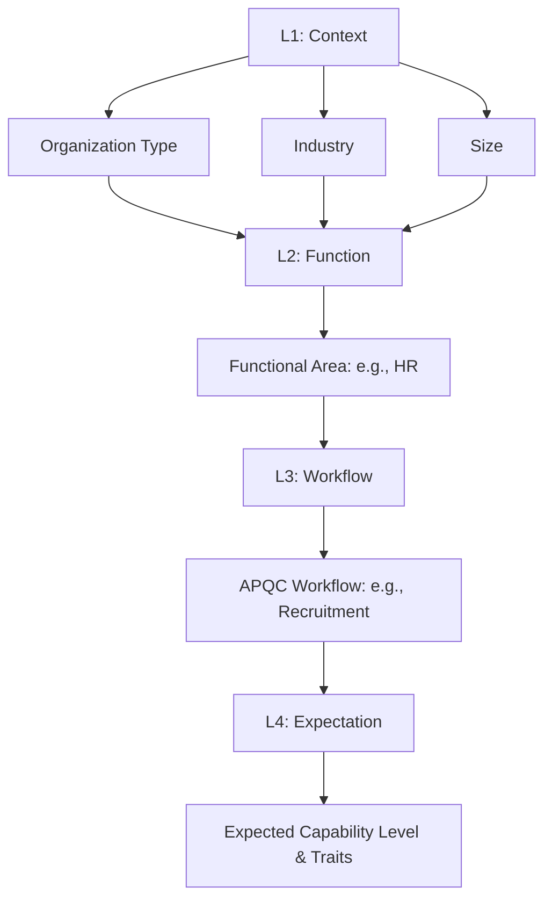
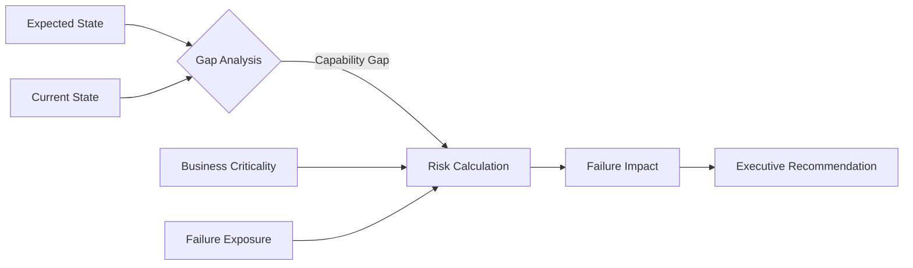
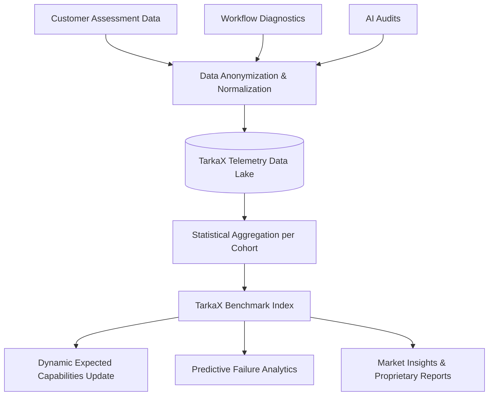

# TarkaX Benchmark Framework v1

## 1. Benchmark Philosophy

**The core directive:** The TarkaX benchmark is an instrument for failure prevention, not a grading system for operational perfection.

TarkaX explicitly rejects the premise of a "100% Maturity Score," a "Perfect Organization," or absolute top-tier benchmarks for all contexts. Operational reality dictates that no organization—including apex market leaders, governments, and elite consulting firms—operates uniformly at maximum capability.

The framework is therefore designed to answer:
*"What capabilities **should** exist for an organization of your specific context, and what risks emerge when those capabilities are missing?"*

Instead of asking, "How good are you?", we evaluate **Expected Capabilities** mapped against a 5-Level Maturity Model:
* **L1 - Fragile**
* **L2 - Emerging**
* **L3 - Operational**
* **L4 - Scaled**
* **L5 - Resilient**

A 10-person startup may reasonably have an "Expected Capability" of *L2 Emerging* for Procurement. Meeting this expectation results in a zero capability gap and minimal operational risk. In contrast, an Enterprise of 10,000 employees with the same *L2 Emerging* Procurement capability faces a massive structural gap from their expected *L4 Scaled* state, generating critical organizational risk.

By anchoring evaluation in contextual expectation, TarkaX acts as an Operational MRI—detecting missing capabilities, governance gaps, and failure patterns based on the organization's unique operational reality.

---

## 2. Capability Framework

TarkaX Expected Capabilities operate simultaneously across two interconnected axes:

### Level A: Cross-Organizational Capabilities
These are structural and systemic traits that span multiple functions and processes.
* **Examples:** Governance, Knowledge Management, Process Ownership, Workflow Visibility, Compliance Controls, Resource Planning.

### Level B: APQC Workflow-Specific Capabilities
These are contextual capabilities required to safely and effectively execute specific, standardized APQC workflows.
* **Examples (Recruitment):** Candidate Pipeline Visibility, Hiring Governance, Interview Standardization.
* **Examples (Invoice Processing):** Approval Controls, Audit Trail, Processing Visibility.

### Expected Capability Matrix (Contextual Application)

**Scenario 1: SMB / Startup (10-50 Employees) - Procurement Workflow**
* **Expected State:** L2 - Emerging
* **Expected Capabilities:**
  * ✓ Basic Spending Visibility
  * ✓ Simple Approval Controls
  * ✓ Centralized Vendor List
* **Current State Evaluation:** L2 - Emerging
* **Missing Capability:** ✗ Formalized Supplier Audits (Acceptable Gap for this size)
* **Risk:** Low. *The organization operates exactly at its expected contextual maturity.*

**Scenario 2: Enterprise (10,000+ Employees) - Procurement Workflow**
* **Expected State:** L4 - Scaled
* **Expected Capabilities:**
  * ✓ Automated Spend Analytics
  * ✓ Multi-Tier Approval Governance
  * ✓ Continuous Supplier Risk Auditing
  * ✓ Integrated Contract Management
* **Current State Evaluation:** L2 - Emerging
* **Missing Capabilities:** ✗ Continuous Supplier Risk Auditing, ✗ Automated Spend Analytics
* **Gap:** 2 Levels
* **Risk:** High. *The organization is structurally exposed to vendor fraud, compliance failure, and runaway spend.*

**Scenario 3: Consulting Firm - Client Delivery Workflow**
* **Expected State:** L4 - Scaled
* **Expected Capabilities:**
  * ✓ Knowledge Management
  * ✓ Client Workflow Visibility
  * ✓ Resource Planning
  * ✓ Delivery Governance
* **Current State Evaluation:** L3 - Operational
* **Missing Capability:** ✗ Standardized AI Policy
* **Gap:** 1 Level
* **Risk:** Medium. *Inconsistent delivery methodologies risk margin erosion and client churn.*

---

## 3. Benchmark Categories

TarkaX processes structured contextual inputs to dynamically determine the Expected Capabilities. This is organized into four cascading benchmark tiers.

* **L1 Benchmark (Context):** The structural identity of the organization. (Organization Type, Industry, Size).
* **L2 Benchmark (Function):** The domain of operations. (e.g., HR, Finance, Procurement, IT).
* **L3 Benchmark (Workflow):** The standardized APQC process. (e.g., Recruitment, Invoice Processing, Incident Management).
* **L4 Benchmark (Expectation):** The contextual Expected Capability level derived from L1, L2, and L3.

### Contextual Inputs

1. **Organization Type:** Consulting Firm, Government Agency, Startup, SMB, Enterprise, Nonprofit.
2. **Organization Size:** 1-20, 20-100, 100-500, 500-5000, 5000+.
3. **Industry:** Consulting, Government, Education, Healthcare, Manufacturing, Financial Services, Technology, Logistics.
4. **Functional Area:** HR, Finance, Procurement, Operations, Marketing, Sales, IT, Compliance.
5. **Workflow Type (APQC):** Recruitment, Employee Onboarding, Invoice Processing, Lead Generation, Opportunity Management.

### Architecture Flow

---

## 4. Capability Gap Model

The Capability Gap Model powers the deterministic calculation of organizational risk. TarkaX explicitly avoids arbitrary mathematical scores for risk calculation.

Instead, risk is defined qualitatively as:
`Risk = Capability Gap × Business Criticality × Failure Exposure`

* **Capability Gap:** The distance between Current State and Expected State (e.g., Expected L4 vs. Current L2).
* **Business Criticality:** How essential the workflow/capability is to the organization's survival or mandate (Low, Moderate, High, Critical).
* **Failure Exposure:** The contextual impact of failure (e.g., Financial penalty, regulatory breach, reputational damage).

### Conceptual Model Flow

**Risk Matrix Example (Missing AI Governance in an Enterprise):**
* **Capability Gap:** High (Expected L4, Current L1)
* **Business Criticality:** High (Core operations depend on data integrity)
* **Failure Exposure:** High (Regulatory fines, IP leakage)
* **Resulting Risk:** **CRITICAL RISK**

---

## 5. Benchmark Output Examples

TarkaX's Benchmark Framework serves as the unified engine across all internal audits. Below are examples of how the framework manifests in executive outputs.

### 1. AI Audit
* **Context:** Enterprise, Financial Services.
* **Expected State:** L4 Scaled AI Governance.
* **Current State:** L2 Emerging.
* **Missing Capability:** Automated PII Redaction in LLM Pipelines.
* **Risk:** Critical (High Exposure to Regulatory Failure).
* **Recommendation:** Immediately halt unchecked third-party LLM deployments and implement an enterprise-grade AI proxy gateway.

### 2. Workflow Diagnostic
* **Context:** SMB, Logistics.
* **Workflow:** Invoice Processing (APQC).
* **Expected State:** L3 Operational.
* **Current State:** L1 Fragile.
* **Missing Capability:** Centralized Audit Trail, Standardized Approval Routing.
* **Risk:** High (Cashflow Bottlenecks, Fraud Vulnerability).
* **Recommendation:** Implement structured approval routing integrated with core accounting software before processing subsequent payment runs.

### 3. Leadership Audit
* **Context:** Consulting Firm (500+ employees).
* **Expected State:** L4 Scaled.
* **Current State:** L3 Operational.
* **Missing Capability:** Cross-functional Resource Forecasting (Level A Capability).
* **Risk:** Medium (Utilization erosion).
* **Recommendation:** Establish a unified resource planning council linking sales pipeline to delivery capacity.

### 4. Manager Audit
* **Context:** Government Agency.
* **Workflow:** Incident Management.
* **Expected State:** L4 Scaled.
* **Current State:** L2 Emerging.
* **Missing Capability:** SLA Enforcement Controls.
* **Risk:** High (Public Trust Erosion).
* **Recommendation:** Deploy automated SLA threshold alerts and mandatory incident post-mortems.

### 5. Employee Audit
* **Context:** Tech Startup (1-20 employees).
* **Workflow:** Employee Onboarding.
* **Expected State:** L2 Emerging.
* **Current State:** L2 Emerging.
* **Gap:** None.
* **Risk:** Low.
* **Recommendation:** Maintain current lightweight processes; do not over-engineer until headcount reaches 50.

### 6. Organizational Alignment Audit
* **Context:** Healthcare Network.
* **Expected State:** L5 Resilient.
* **Current State:** L3 Operational.
* **Missing Capability:** Enterprise Process Ownership.
* **Risk:** Critical (Compliance silos, inconsistent patient care workflows).
* **Recommendation:** Establish dedicated Process Owners for all core clinical and operational value streams.

---

## 6. Benchmark Index Design (Future State)

The future of TarkaX benchmarking relies on continuously aggregating anonymous assessment data to build the **TarkaX Benchmark Index**.

This system will transition TarkaX from *static expected capabilities* to *dynamic, statistically driven operational intelligence*.

**Metrics to Collect (Anonymized):**
* L1/L2/L3 Contextual Metadata.
* Observed Capability Levels across specific APQC workflows.
* Frequency of Specific Failure Patterns per industry.
* Time-to-Maturity (velocity of capability adoption).

**How Benchmarking Evolves:**
Instead of static rules engines defining "What should a Startup expect for Procurement?", the Index will continuously calculate the true operational median for specific cohorts. It will begin predicting failure patterns: *"Organizations in Healthcare sized 500-5000 that lack L3 Knowledge Management suffer compliance failures at 4x the baseline rate."*

**The Competitive Moat:**
As the Dataset grows, TarkaX becomes the definitive proprietary database of Organizational Failure Intelligence. Competitors may replicate workflow software, but they cannot replicate the millions of anonymous diagnostic data points proving exactly *why* and *where* organizations fail based on their specific structural context.

### Future State Index Architecture

