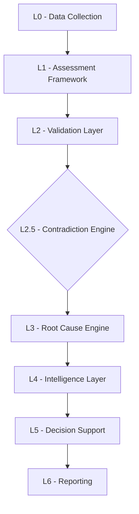

# TarkaX Contradiction Engine V1 (L2.5) Architecture

## 1. Objective

The Contradiction Engine (L2.5) acts as the Organizational Reality Detection layer within the TarkaX platform. Positioned strategically between the Validation Layer (L2) and the Root Cause Engine (L3), its primary purpose is to identify gaps between claimed reality and actual evidence.

The objective is **not** fraud detection or "gotcha" penalization. Rather, it is designed to uncover hidden organizational misalignments—illuminating reality gaps across governance, operational execution, and leadership perception. These reality gaps serve as first-class evidence inputs for downstream root cause analysis and transformation planning.

### Engine Positioning Pipeline


---

## 2. Contradiction Taxonomy

Contradictions are structured across two core dimensions: **Internal vs. Cross-Persona** and **Strategic vs. Operational (APQC)**.

### 2.1 Contradiction Types

#### Type 1: Internal Contradictions (Intra-Audit)
Detects logical inconsistencies within a single response or context (Claim vs. Evidence).
*   **Focus:** Is this response self-consistent?
*   **Example:**
    *   *Claim:* "We are highly automated."
    *   *Evidence:* "15 manual steps detailed in the workflow graph."

#### Type 2: Cross-Persona Contradictions (Inter-Audit)
Detects perception gaps between different organizational cohorts responding to the same subject matter.
*   **Focus:** Do different groups perceive reality differently?
*   **Example:**
    *   *Leadership:* "AI Adoption = High (89)"
    *   *Employees:* "AI Adoption = Low (37)"

### 2.2 Taxonomy Mapping Layers

Every detected contradiction must map to *both* levels of the organizational ontology:

*   **Level A: Strategic Failure Taxonomy (Executive View)**
    *   Governance Gaps
    *   AI Adoption Gaps
    *   Workflow Execution Gaps
    *   Communication Gaps
    *   Knowledge Management Gaps
    *   Tool Utilization Gaps
*   **Level B: APQC Taxonomy (Operational View)**
    *   e.g., *Finance -> Invoice Processing*
    *   e.g., *HR -> Recruitment*

### 2.3 Contradiction Severity Classification
*   **Critical:** Fundamental disconnect in highly critical business workflows; severe risk to transformation.
*   **High:** Major perception or execution gap requiring immediate remediation planning.
*   **Medium:** Operational misalignment causing friction or localized inefficiency.
*   **Low:** Minor inconsistencies in terminology or localized tool usage.

---

## 3. Input Signals

The Contradiction Engine is a deterministic rule-engine fed by structured signals emitted from the Assessment (L1) and Validation (L2) layers.

| Input Signal | Description | Reliability | Weighting |
| :--- | :--- | :--- | :--- |
| **MCQ Quantitative Scores** | Numerical maturity scores provided by different personas (Leadership, Manager, Employee). | High (for cross-persona gaps) | High (Primary driver for Type 2) |
| **Evidence Metadata** | L2 Validation signals regarding presence/absence of artifacts (e.g., `artifact_exists: false`). | Very High | Critical (Driver for Type 1) |
| **Workflow Graph Metrics** | Deterministic counts of nodes (e.g., manual vs. automated steps extracted from L0). | High | High |
| **Tool Inventory Logs** | Actual tool usage data or API integration metrics (if available). | Absolute | Critical |
| **L2 Confidence Index** | The baseline trustworthiness score of the underlying data point. | High | Modulates the final Contradiction Risk Score |

---

## 4. Scoring Model

The Engine outputs two distinct scoring metrics:

### 4.1 Individual Contradiction Score (0–100)
Calculated *per detected contradiction* based on the severity of the gap and the reliability of the evidence.

*   **0–20 (Low Risk):** Minor discrepancy. Example: Slight difference in perception of tool effectiveness between two managers.
*   **21–40 (Moderate Risk):** Noticeable misalignment. Example: Employees report manual steps where leadership assumed partial automation.
*   **41–60 (Significant Risk):** Clear reality gap. Example: Claimed governance maturity is High, but L2 confirms no policy documents exist.
*   **61–80 (High Risk):** Major organizational disconnect. Example: Leadership claims widespread AI adoption, but actual tool inventory shows zero active licenses.
*   **81–100 (Severe Risk):** Critical misalignment. Leadership perception and operational reality are entirely detached in a business-critical APQC workflow.

### 4.2 Organizational Contradiction Index (0–100)
An aggregate, weighted average of all high-confidence contradictions detected across the assessment context. This serves as a headline diagnostic metric indicating the overall "Reality Gap" of the organization.

---

## 5. Reality Gap Detection Framework

The detection framework relies on deterministic mathematical thresholds and boolean logic.

**Rule Example: Type 2 (Cross-Persona AI Adoption Gap)**
```javascript
// Pseudo-logic for deterministic detection
if (Math.abs(Leadership.AI_Score - Employee.AI_Score) > 50) {
    emitContradiction({
        type: 'CROSS_PERSONA',
        category: 'AI_ADOPTION_GAP',
        score: calculateSeverity(Leadership.AI_Score, Employee.AI_Score),
        severity: 'HIGH'
    });
}
```

**Rule Example: Type 1 (Internal Governance Gap)**
```javascript
if (Response.Governance_Claim == 'SCALED' && Response.Evidence.hasPolicyDocument == false) {
     emitContradiction({
        type: 'INTERNAL',
        category: 'GOVERNANCE_GAP',
        score: 75,
        severity: 'HIGH'
    });
}
```
*Note: V1 architecture relies strictly on these deterministic rules. The data schema will allow future LLM semantic layers (V2) to append supportive contradiction signals without altering the core deterministic scoring.*

---

## 6. Output Design

To maintain the TarkaX consulting persona, outputs must be framed objectively as "Reality Gaps" rather than penalizations. The system does not output `Contradiction = True`.

**Standardized Output Structure:**

*   **Finding:** A professional statement of the reality gap.
*   **Evidence:** The specific conflicting data points.
*   **Risk:** What this gap threatens.
*   **Potential Impact:** The business consequence of the gap.
*   **Recommended Validation Steps:** Actions the consultant/organization should take to verify.

**Example Payload:**
```json
{
  "finding": "Evidence suggests potential misalignment regarding AI adoption maturity.",
  "evidence": "Leadership capability score (89) significantly exceeds Employee capability score (37).",
  "risk": "Strategic transformation initiatives may be planned on inaccurate operational assumptions.",
  "potential_impact": "Low actual adoption rates leading to poor ROI on tooling investments.",
  "validation_steps": "Conduct a tool utilization audit targeting frontline employees in the affected APQC process group."
}
```

---

## 7. Root Cause Integration & Data Flow

The Contradiction Engine is a critical prerequisite for the L3 Root Cause Engine.

1.  **Validation Layer (L2)** verifies the physical presence and quality of evidence.
2.  **Contradiction Engine (L2.5)** consumes L1 responses and L2 evidence flags to generate `Contradiction Insights`.
3.  **Root Cause Engine (L3)** consumes these `Contradiction Insights` as primary evidence. Instead of just knowing "AI adoption is low," L3 now knows "Leadership *thinks* AI adoption is high, but it is actually low." This allows L3 to diagnose the root cause as "Upward Communication Failure" or "Leadership Isolation" rather than just a "Technology Gap."

---

## 8. Report Integration (TarkaX Report V2)

The final diagnostic report will include a dedicated **Organizational Reality** section.

**Components:**
1.  **Organizational Contradiction Index:** e.g., "Reality Gap Index: 62/100 (High)"
2.  **Top Contradictions Summary:** Visual delta charts (Recharts) showing Leadership vs. Employee capability scores across APQC groups.
3.  **Strategic Misalignment Table:** Listing the top 3 critical reality gaps, their business impact, and recommended alignment workshops.

---

## 9. Exact Architecture

### 9.1 Data Model (PostgreSQL / Supabase)

Data is stored in normalized relational tables.

#### `contradiction_rules`
Stores the deterministic logic rules for engine execution.
*   `rule_id` (UUID, PK)
*   `rule_type` (Enum: `INTERNAL`, `CROSS_PERSONA`)
*   `strategic_category_id` (FK to Level A Taxonomy)
*   `base_condition` (JSONB) - Defines the deterministic threshold (e.g., `{"metric": "score_delta", "threshold": 50}`)
*   `base_severity` (Enum: `LOW`, `MEDIUM`, `HIGH`, `CRITICAL`)

#### `assessment_contradictions`
Stores the realized reality gaps detected during an assessment.
*   `contradiction_id` (UUID, PK)
*   `assessment_id` (UUID, FK)
*   `rule_id` (UUID, FK)
*   `apqc_process_id` (UUID, FK to Level B Taxonomy)
*   `contradiction_score` (Integer, 0-100)
*   `finding_text` (Text)
*   `evidence_text` (Text)
*   `risk_text` (Text)
*   `impact_text` (Text)
*   `validation_text` (Text)
*   `created_at` (Timestamp)

#### `contradiction_evidence_links`
A junction table linking a contradiction to the specific L1/L2 data points that triggered it.
*   `link_id` (UUID, PK)
*   `contradiction_id` (UUID, FK)
*   `source_entity_type` (Enum: `QUESTION_RESPONSE`, `EVIDENCE_RECORD`)
*   `source_entity_id` (UUID)

### 9.2 API Changes

**New Internal Service Endpoint:**
`POST /api/v1/engine/contradiction/execute`
*   **Payload:** `{ "assessment_id": "uuid" }`
*   **Action:** Fetches all L1/L2 data for the assessment, runs the rule engine, populates `assessment_contradictions`, and updates the aggregate `Organizational Contradiction Index` on the core assessment record.

**Report Read Endpoint:**
`GET /api/v1/reports/{assessment_id}/reality-gaps`
*   **Action:** Returns structured JSON for the Report V2 frontend, containing the aggregate index and the top contradictions ordered by severity.

### 9.3 Engine Components

1.  **Signal Aggregator:** Fetches cross-persona scores and L2 validation flags for a given assessment.
2.  **Deterministic Rules Evaluator:** Iterates through `contradiction_rules`. Executes boolean logic (Internal Claim vs. Evidence) and mathematical deltas (Cross-Persona).
3.  **Insight Generator:** Formats the triggered rules into the consulting-grade output payload (Finding, Evidence, Risk).
4.  **Persistence Layer:** Saves outputs to `assessment_contradictions` for downstream L3 consumption.