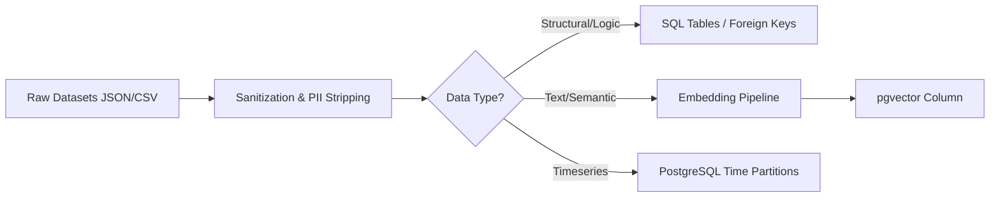
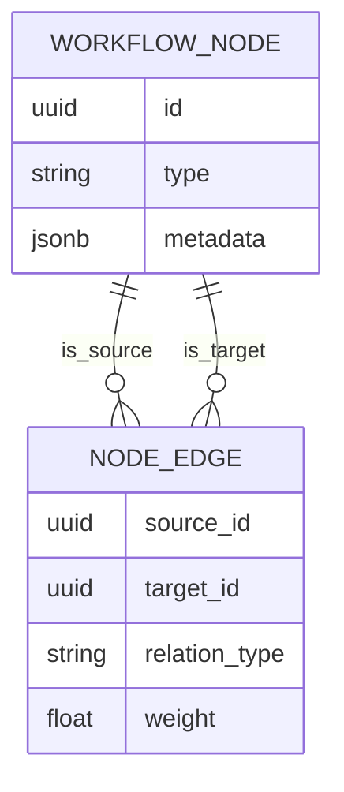
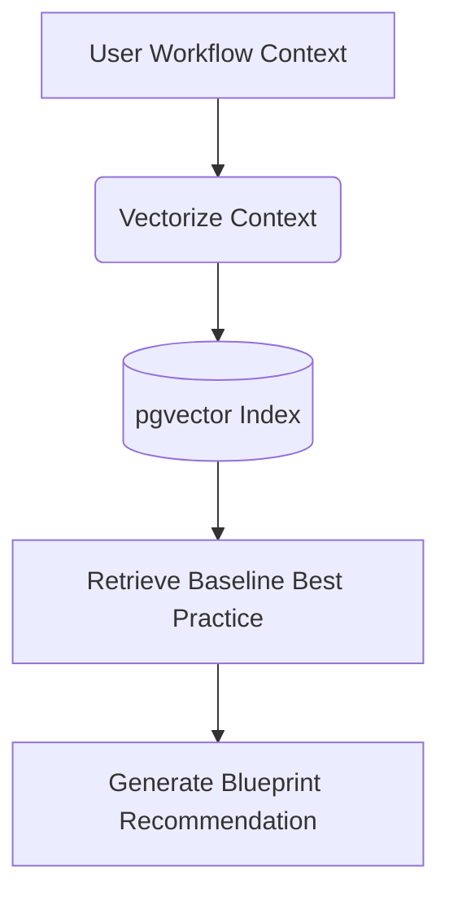
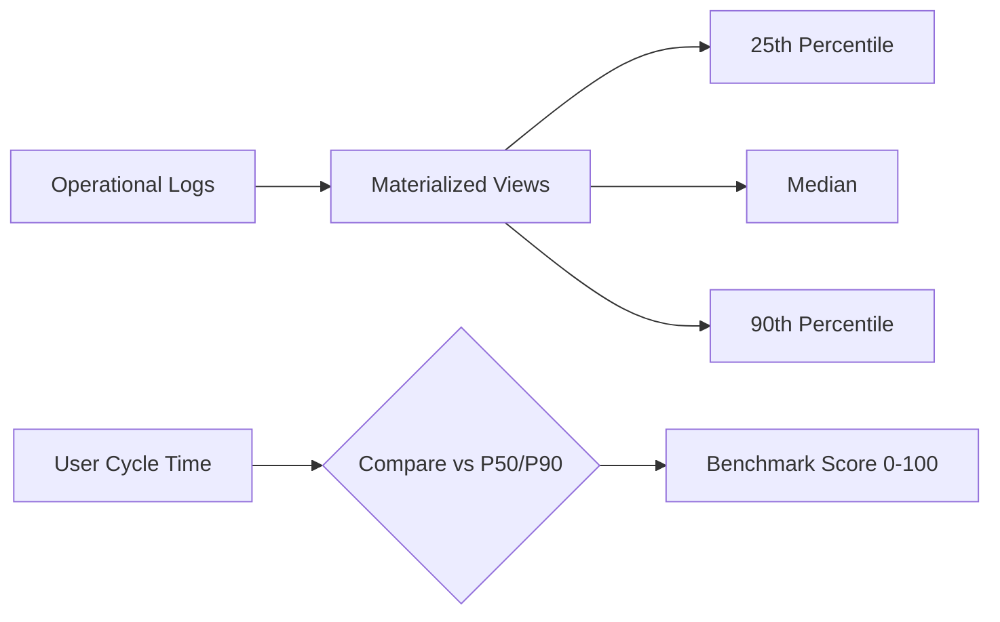
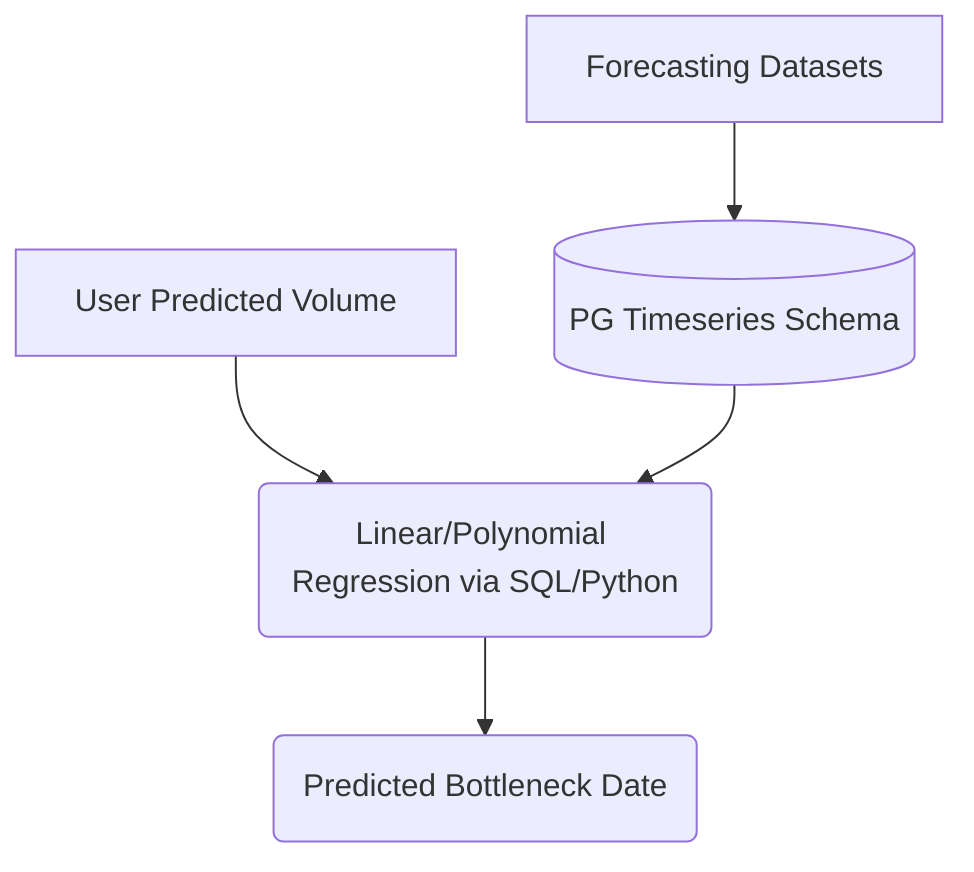

# TARKAX Dataset Architecture

## 1. Executive Summary
This document operationalizes the findings from the TARKAX Dataset Intelligence Layer. It defines how the Top 5 High-ROI datasets are ingested, preprocessed, vectorized, and stored to power the core intelligence engines of TARKAX. Following the principle of "Controlled Convergence" and "No Premature Platformization," the Phase 1 architecture relies exclusively on the existing PostgreSQL/pgvector foundation.

---

## 2. Top 5 High-ROI Dataset Operationalization

The following operationalization applies to the top 5 strategic datasets designed to be integrated within a 90-day, single-engineer sprint.

### 2.1. `llm4pm/process_mining_questions` (Process Mining)
* **Ingestion Method:** One-time bulk load (CSV/JSON script).
* **Storage Strategy:** Relational tables for structural event sequences; `pgvector` for embedding specific query intents.
* **Update Cadence:** Static (Quarterly review).
* **Preprocessing Requirements:** Normalize graph-like node relations into hierarchical parent-child rows (Adjacency List model in PostgreSQL).
* **Feature Extraction Opportunities:** Sequence length, cycle times, bottleneck nodes.
* **Vectorization Requirements:** Embed questions and common anomaly descriptions to map user inputs against known process failures.
* **Governance Considerations:** Low risk (academic/synthetic structural data).

### 2.2. `bitext/Bitext-customer-support-llm-chatbot-training-dataset` (Customer Support)
* **Ingestion Method:** Automated script mapping HF JSONL to PostgreSQL.
* **Storage Strategy:** Vectorized text chunks (`pgvector`) for RAG.
* **Update Cadence:** Bi-annual.
* **Preprocessing Requirements:** Strip PII-like artifacts; chunk text by specific user intent vs. agent action pairs.
* **Feature Extraction Opportunities:** Routing depth (how many hops to resolution).
* **Vectorization Requirements:** Dense embeddings of customer intents to match against the user's workflow trigger definitions.
* **Governance Considerations:** Ensure no accidental bleeding of standard intents into custom enterprise proprietary routing logic.

### 2.3. `ClarusC64/legal-undertaking-order-obligation-compliance-coherence-risk-v0.1` (Risk & Compliance)
* **Ingestion Method:** One-time script.
* **Storage Strategy:** Core relational Knowledge Base table linked to pgvector similarity indexes.
* **Update Cadence:** Annual or on major regulatory shifts.
* **Preprocessing Requirements:** Extract explicit rules (e.g., "Must notify within 48 hours") into distinct boolean evaluation fields.
* **Feature Extraction Opportunities:** SLA time limits, mandatory approval steps.
* **Vectorization Requirements:** Embed the compliance "spirit" to match against vaguely described workflow steps in TARKAX.
* **Governance Considerations:** Strictly tag as "Baseline Reference Only" to avoid liability for providing legal advice.

### 2.4. `Fdddhhhill/enterprise_ai_forecasting_dataset.csv` (Forecasting)
* **Ingestion Method:** Batch load into a dedicated Timeseries schema within PostgreSQL.
* **Storage Strategy:** PostgreSQL partitioning by date/category.
* **Update Cadence:** Static primer.
* **Preprocessing Requirements:** Aggregate into daily/weekly macro velocities; normalize volume metrics to percentage-based baselines.
* **Feature Extraction Opportunities:** Seasonal multipliers, baseline throughput rates.
* **Vectorization Requirements:** N/A (pure numerical/relational querying).
* **Governance Considerations:** Ensure strict separation from proprietary user telemetry data.

### 2.5. `alalfi/SupplyChainDataset` (Supply Chain / Bottlenecks)
* **Ingestion Method:** Batch script mapping supply chain nodes to abstract digital workflow equivalents.
* **Storage Strategy:** Relational schema optimized for recursive queries (CTE).
* **Update Cadence:** Static.
* **Preprocessing Requirements:** Abstract physical terms ("Warehouse", "Shipping") to digital equivalents ("Queue", "Processing"). Calculate theoretical lead times.
* **Feature Extraction Opportunities:** Queue length, wait time, processing time variance.
* **Vectorization Requirements:** N/A.
* **Governance Considerations:** Low risk.

---

## 3. Top 10 Immediate Candidates (Expansion Phase)
These next 5 datasets form the future expansion pipeline (Post-90 Days):
* `ai-in-projectmanagement/ProjectManagementLLM_dataset`: To enrich the Recommendation Engine with standard WBS (Work Breakdown Structures).
* `alezzandro/itsm_tickets`: To deepen Diagnostic Intelligence for IT-specific workflows.
* `monodox/hr-and-people-operations`: For HR onboarding/offboarding workflow benchmarking.
* `markobo/B2B_Sales_data`: For Sales pipeline velocity benchmarking.
* `interneuronai/companyx_customer_support_ticket_routing_distilbert_dataset`: To refine decision-tree routing recommendations.

## 4. End-to-End TARKAX Data Flow

```mermaid
flowchart TD
    subgraph HF Hub
        DS1(Process Mining)
        DS2(Compliance Risk)
        DS3(Forecasting)
    end

    subgraph TARKAX Ingestion Layer
        Loader(Batch Processing Scripts)
        Normalizer(Schema Normalization)
        Embedder(Text Embedding Model)
    end

    subgraph TARKAX Unified Datastore [PostgreSQL / pgvector]
        Graph(Workflow Knowledge Graph\nRelational CTEs)
        RecDB(Recommendation KB\nVectors + Relational)
        BenchDB(Benchmark Intelligence\nAggregates)
        ForeDB(Forecast Data Layer\nTimeseries Schema)
    end

    subgraph TARKAX Intelligence Engines
        Diag(Diagnostic Engine)
        Rec(Recommendation Engine)
        Bench(Benchmark Engine)
        FC(Forecast Engine)
    end

    HF Hub --> Loader
    Loader --> Normalizer
    Normalizer --> Embedder
    Normalizer --> Graph
    Normalizer --> BenchDB
    Normalizer --> ForeDB
    Embedder --> RecDB

    Graph --> Diag
    RecDB --> Rec
    BenchDB --> Bench
    ForeDB --> FC
```

## 5. Knowledge Layer Architecture (Phase 1: PostgreSQL Native)

### 5.1 Dataset Ingestion Layer


### 5.2 Workflow Knowledge Graph
Since graph databases (Neo4j) are prohibited in Phase 1, the Graph is simulated using PostgreSQL Recursive Common Table Expressions (CTEs).


### 5.3 Recommendation Knowledge Base
Powered by semantic similarity searches against known good workflow patterns.


### 5.4 Benchmark Intelligence Layer
A relational aggregation schema calculating percentile distributions of cycle times.


### 5.5 Forecast Intelligence Layer
Uses historical time-series data to establish velocity baselines.


## 6. Architecture Components & Phasing Matrix

The architecture is designed to scale with product maturity, ensuring maximum output per engineering hour.

### Phase 1 (0 - 90 Days): The Monolithic Intelligence Core
*Objective: Deliver zero-shot intelligence using strictly existing infrastructure (PostgreSQL/pgvector).*

| Component | Purpose | Business Value | Tech Complexity | Maintenance Cost |
|---|---|---|---|---|
| **Batch Ingestion Scripts** | Extract and load HF datasets into local DB. | Feeds the intelligence engines. | Low | Low (Run once/rarely) |
| **`pgvector` RAG Engine** | Semantic matching for Recommendations/Diagnostics. | Core IP for Workflow AI Audit. | Low (Native extension) | Low |
| **Relational Graph CTEs** | Store process mining nodes and edges in SQL. | Detects structural anomalies. | Medium (Complex SQL) | Low |
| **Materialized Views (Benchmarking)** | Store pre-calculated industry standard cycle times. | Fast loading of benchmark comparisons. | Low | Low |

### Phase 2 (3 - 6 Months): Specialized Execution
*Objective: Extract complex processing out of the core monolithic database if (and only if) performance dictates it.*

| Component | Purpose | Business Value | Tech Complexity | Maintenance Cost | Recommendation |
|---|---|---|---|---|---|
| **Dedicated Timeseries DB (TimescaleDB)** | Handle massive volume of event logs. | Enables real-time Forecasting. | Medium | Medium | *Recommended if forecasting volume exceeds PG limits.* |
| **Distributed Task Queue (Celery/Redis)** | Process long-running dataset ingestion and embedding jobs asynchronously. | Prevents API timeouts during heavy AI workloads. | Medium | Medium | *Recommended for simulation/forecasting tasks.* |

### Phase 3 (6 - 12 Months): Platformization
*Objective: Transition to a highly scalable, dedicated Operational Intelligence ecosystem.*

| Component | Purpose | Business Value | Tech Complexity | Maintenance Cost | Recommendation |
|---|---|---|---|---|---|
| **Native Graph Database (Neo4j)** | Advanced multi-hop bottleneck analysis. | Enables massive-scale Simulation Intelligence. | High | High | *Recommended only when standard SQL CTEs fail.* |
| **Dedicated Vector DB (Pinecone/Weaviate)** | Massive scale semantic search across millions of logs. | Global cross-tenant benchmarking. | High | High | *Recommended if pgvector performance degrades.* |
| **Streaming Pipeline (Kafka)** | Real-time event log processing from enterprise integrations. | Live Operational MRI. | High | Very High | *Final maturity stage.* |

---

## 7. The Strategic Imperative

**Question:** *"What is the smallest architecture capable of delivering Workflow Intelligence, Recommendations, Benchmarking, and Forecasting within 90 days?"*

**Answer:**
The absolute smallest, single-engineer architecture is the **Unified PostgreSQL Intelligence Monolith**.

1.  **Database:** A single PostgreSQL instance.
2.  **Vectorization:** `pgvector` extension installed on that instance.
3.  **Graph Logic:** Standard relational tables (`workflow_nodes`, `node_edges`) utilizing recursive Common Table Expressions (CTEs) for tree traversal and bottleneck mapping.
4.  **Forecasting/Benchmarking:** Standard numerical columns and Materialized Views updating on a cron schedule.
5.  **Compute:** The existing FastAPI backend performing lightweight regression and RAG prompt assembly before passing context to the LLM.

**Why?**
If any of these components (like Neo4j or Pinecone) were introduced prematurely, the 90-day sprint would be consumed by DevOps, infrastructure provisioning, and network VPC configuration. By forcing all datasets (process mining, compliance rules, support routing, forecasting data) into standard PostgreSQL relational, JSONB, and Vector formats, one engineer can ingest, query, and deliver the capability layers directly within the existing application context.

The business capability lost by not using a dedicated Graph DB today is *millisecond multi-hop queries on graphs with millions of nodes*. TARKAX does not need this today; it needs deterministic structural validation on workflows with fewer than 50 steps. PostgreSQL is more than capable, ensuring the engineer focuses entirely on building intelligence, not infrastructure.
