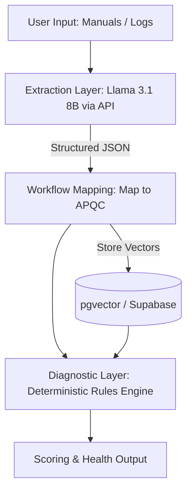
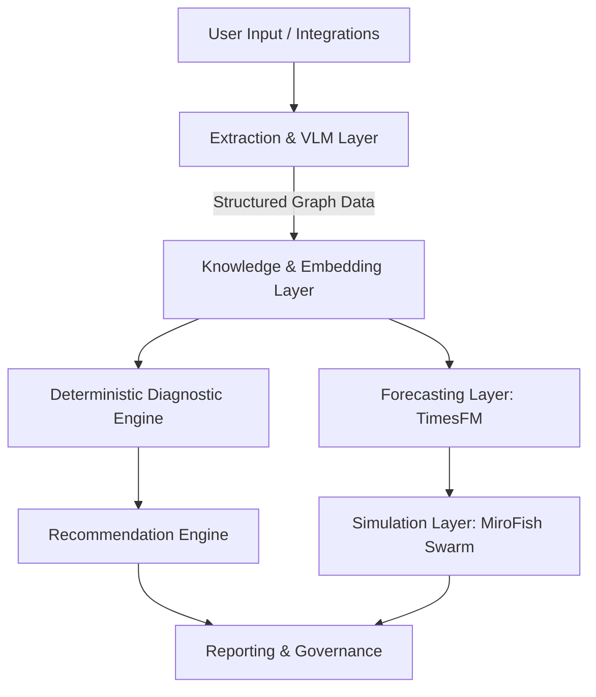

# TARKAX AI Model Architecture
**Role**: Principal AI Architect / Enterprise Workflow Intelligence Expert

## Executive Summary
This document outlines the complete AI Model Architecture for TARKAX, focusing on Operational Intelligence, deterministic scoring, explainability, governance, and cost-efficiency. TARKAX is not a chatbot platform; it is a modular system designed for workflow extraction, classification, and diagnostics. This architecture strictly adheres to a deterministic-first philosophy: agents normalize and map data, but final health scoring remains transparent, explainable, and rule-based.

All recommendations are mapped to the APQC process framework to ensure standardized enterprise applicability.

---

## 1. Workflow Intelligence (Task Inventory)
TARKAX requires specific AI tasks to map raw enterprise inputs into structured operational intelligence.

| Task | Input | Output | Business Value & APQC Mapping |
|------|-------|--------|--------------------------------|
| **Workflow Extraction** | Raw text, docs, unstructured manuals | Structured JSON (Nodes, Edges, Roles, Systems) | Reduces manual mapping effort; anchors to APQC Process Categories (e.g., 3.0 Market and Sell Products). |
| **Process Classification** | Structured JSON workflows | APQC Process ID & Category | Enables standardized benchmarking across industries. |
| **Semantic Search & Retrieval** | User query, workflow metadata | Relevant existing workflows, benchmarks, rules | Faster discovery of operational knowledge and avoiding duplicated efforts. |
| **Bottleneck Detection** | Execution logs, structured workflow graphs | Highlighted nodes with high latency/risk | Identifies operational inefficiencies (APQC 10.0 Manage Enterprise Risk, Compliance). |
| **Recommendation Generation** | Bottlenecks + APQC Benchmark Data | Actionable workflow improvements (text & graph diffs) | Drives continuous improvement (APQC 12.0 Manage Business Capabilities). |
| **Governance & Risk Analysis** | Workflow steps + Compliance frameworks | Risk score, missing controls | Ensures regulatory alignment and operational safety. |
| **Forecasting** | Historical execution volumes/times | Predicted future volume & resource constraints | Proactive operational scaling and workforce management. |
| **Simulation** | Workflow graph + Forecasted volume | Simulated execution outcomes (delays, costs) | Stress-testing operations before real-world implementation. |

---

## 2. Model Selection Matrix
For each task, we select the optimal model category based on TARKAX's need for accuracy and determinism.

| Task Category | Best Model Category | Why |
|---------------|---------------------|-----|
| **Extraction & Classification** | Instruction-Tuned LLM / VLM | High zero-shot capability for converting unstructured text/images into strict JSON schemas. |
| **Semantic Search / Similarity** | High-Dimensional Embedding Model | Captures deep semantic meaning across multiple languages/modalities; fast similarity vector search in pgvector. |
| **Bottleneck & Governance Analysis** | Deterministic Rules Engine (assisted by NLP) | Final scoring *must* be auditable. LLMs only extract features; the engine applies rules (e.g., "if step lacks approval node, risk = high"). |
| **Forecasting** | Time-Series Foundation Model | Specialized in zero-shot predictive analytics on sequential data without requiring heavy per-customer training. |
| **Simulation** | Multi-Agent Swarm / Graph Engine | Captures emergent behavior in complex workflows by simulating individual actor constraints and interactions over a digital twin. |

---

## 3. Hugging Face Landscape (Enterprise Open Models)
To support TARKAX's extraction and reasoning needs while ensuring data privacy, we prioritize open-weights models that can be self-hosted or run on managed private infrastructure.

### A. Workflow Understanding, Classification & Extraction (LLMs)

#### 1. Llama 3.1 (70B & 8B)
* **Model Family:** Meta Llama
* **Parameters:** 70B (High-Accuracy) / 8B (Fast Extraction)
* **Inference Requirements:** ~140GB VRAM (70B at 16-bit), ~14GB VRAM (8B at 16-bit)
* **Quantized Options:** Excellent support (GGUF, AWQ, 4-bit/8-bit available)
* **Enterprise Suitability:** Very High. Highly reliable for JSON formatting.
* **Strengths:** Top-tier reasoning, high instruction following, massive community support.
* **Weaknesses:** 70B is expensive to host 24/7 for low-volume tasks.
* **Maintenance Risk:** Low. Constant ecosystem updates.

#### 2. Qwen 2.5 (72B, 32B, 7B)
* **Model Family:** Alibaba Qwen
* **Parameters:** 32B is the sweet spot for TARKAX extraction.
* **Inference Requirements:** ~64GB VRAM (32B at 16-bit). Can fit on a single A100.
* **Quantized Options:** Extensive.
* **Enterprise Suitability:** High. SOTA coding and structured data performance.
* **Strengths:** Excellent at structured JSON generation and complex reasoning.
* **Weaknesses:** Less native English cultural nuance than Llama, but irrelevant for structural workflow parsing.
* **Maintenance Risk:** Low to Medium.

#### 3. Command R+
* **Model Family:** Cohere (Open Weights for research, enterprise API available)
* **Parameters:** 104B
* **Enterprise Suitability:** Very High. Purpose-built for RAG and tool use.
* **Strengths:** Native citation, multi-step tool use, excellent at connecting complex documents to workflow structures.
* **Weaknesses:** Very heavy. High compute cost.

### B. Embedding Models (Semantic Search & Governance Matching)

#### 1. Harrier-OSS-v1-27B & 0.6B (Microsoft)
* **Model Family:** Multilingual text embeddings.
* **Parameters/Dims:** 27B (5376 dims) for SOTA; 0.6B (1024 dims) for fast inference.
* **Strengths:** Highest MTEB score, massive 32K context window.
* **Enterprise Suitability:** Perfect for mapping dense workflow documents to APQC categories.
* **Weaknesses:** 27B requires 80GB+ VRAM.

#### 2. Qwen3-Embedding-8B
* **Parameters/Dims:** 8B (4096 dims)
* **Strengths:** Open source (Apache), high performance multilingual retrieval.
* **Enterprise Suitability:** Great balance of cost vs. performance for self-hosted pgvector integration.

---

## 4. TimesFM Evaluation (Forecasting)
**TimesFM (Google Research)** is a 200M-parameter, decoder-only transformer pre-trained on 10 billion time points. It is designed for zero-shot time-series forecasting.

### Evaluation for TARKAX Capabilities
| Capability | Expected Value | Implementation Complexity |
|------------|----------------|---------------------------|
| **Workflow Forecasting** | Predicts peak workflow volume to auto-scale processing queues. | Medium (Zero-shot works out of the box, mapping schema is standard). |
| **Hiring Forecasts** | Predicts long-term staffing needs based on anticipated business growth. | High (Requires external economic variables and historical pipeline data). |
| **Support Ticket Forecasts** | Anticipates customer support load to dynamically allocate agents. | Low (Direct mapping from ticket history to volume predictions). |
| **Workload Forecasts** | Projects required FTE count based on historical step execution times and APQC benchmarks. | High (Requires correlating volume with human effort metadata). |
| **Sales Pipeline Forecasts** | Forecasts conversion times for "Market and Sell" APQC processes. | Medium. |
| **Operational Forecasting** | Broad predictions on resource consumption (server usage, physical materials). | Medium. |

### Architectural Insights & Limitations
* **Architecture:** Uses a patching mechanism (like Vision Transformers) to group time steps, drastically reducing computational overhead.
* **Strengths:** Zero-shot capability means no customer-specific training required (slashing PoC costs). Supports in-context fine-tuning (TimesFM-ICF). 16,000 time-step context window.
* **Limitations:** Primarily excels at univariate or lightly multivariate numerical data. It cannot natively ingest text or categorical event logs without heavy pre-processing.

---

## 5. MiroFish Evaluation (Simulation & Diagram Parsing)
**MiroFish** is an open-source AI prediction engine that utilizes Multi-Agent Swarm Intelligence over Knowledge Graphs (GraphRAG). It spawns parallel digital worlds populated by heterogeneous AI agents with independent behavioral logic.

### Evaluation for TARKAX Capabilities
| Capability | Expected Value | Implementation Complexity |
|------------|----------------|---------------------------|
| **Workflow Extraction** | Converts diagrams into a base Knowledge Graph of actors and dependencies. | High. |
| **Process Diagram Ingestion** | Maps visual relations to structural workflows. | Medium. |
| **BPMN Interpretation** | Translates static BPMN logic into dynamic simulation rules. | High. |
| **Miro Board Parsing** | Extracts spatial relationships and sticky notes into structured process nodes. | Medium (Requires mapping unstructured whiteboard data to APQC). |
| **Workflow Graph Generation** | Generates dynamic edges based on agent interaction patterns. | Very High. |

### Architectural Insights & Limitations
* **Architecture:** Operates a 5-step pipeline: Knowledge Graph construction (via GraphRAG) -> Environment Setup -> Agent Creation -> Simulation -> Consensus Reporting.
* **Strengths:** Moves beyond static rules to capture emergent bottlenecks (e.g., how an approval delay cascades through a complex team structure).
* **Limitations:** High compute overhead. Simulating 50-200 agents is feasible, but enterprise workflows with thousands of actors require massive parallel computing.
* **Integration Strategy:** Should be used *only* for the Future-State Simulation Layer, triggered on-demand rather than running constantly.

---

## 6. Architecture Design

### Phase 1 Architecture (Current Constraints: PostgreSQL, pgvector, Supabase)
TARKAX currently operates under strict "controlled convergence." The Phase 1 AI architecture avoids complex external infrastructure.

* **Extraction Layer:** Lightweight LLM (e.g., Llama 3.1 8B or Qwen 2.5 32B) deployed statelessly to parse input.
* **Knowledge Layer:** PostgreSQL with `pgvector` for semantic search against APQC benchmarks.
* **Diagnostic Layer:** Python-based rule engine. **No LLMs are used for final scoring.**

### Target Architecture (Future State)
This introduces specialized models for forecasting and simulation, requiring dedicated compute but remaining tightly integrated with the core system.

* **Workflow Understanding Layer:** Multimodal (Llama 3.1 Vision or Qwen-VL) for UI/BPMN parsing.
* **Knowledge Layer:** Graph-enhanced vector stores (Future: Neo4j integration; Present: relational mapping in Postgres).
* **Diagnostic Layer:** Deterministic scoring.
* **Forecasting Layer:** TimesFM for zero-shot time-series predictions.
* **Simulation Layer:** MiroFish for agentic stress-testing of proposed workflow changes.

---

## 7. Prioritization Roadmap

| Rank | Initiative | ROI | Classification | Impact & Complexity |
|------|------------|-----|----------------|---------------------|
| 1 | **Deterministic Diagnostic Engine Core** | Highest | P0 | **Impact:** Foundation of TARKAX. Auditable and reliable. **Complexity:** Low (Rule-based). |
| 2 | **LLM-Based Workflow Extraction to JSON** | High | P1 | **Impact:** Unblocks manual data entry bottleneck. **Complexity:** Medium (Prompt engineering, Zod schemas). |
| 3 | **APQC Vector Embedding Mapping** | High | P1 | **Impact:** Standardizes all workflows across the enterprise. **Complexity:** Low (pgvector + Open Embeddings). |
| 4 | **Recommendation Generation** | Medium | P2 | **Impact:** Closes the loop from insight to action. **Complexity:** Medium. |
| 5 | **TimesFM Forecasting** | Medium | P3 | **Impact:** Operational scaling predictions. **Complexity:** Medium (Requires clean historical data pipelines). |
| 6 | **MiroFish Agentic Simulation** | Lowest | P4/P5 | **Impact:** High novelty, but niche use cases. **Complexity:** Very High (Requires heavy compute and complex tuning). |

---

## 8. Technical Risks

1. **LLM Hallucination in Extraction:** If the LLM invents workflow nodes, the deterministic engine will score phantom risks. *Mitigation:* Strict JSON schema validation (Zod) and confidence thresholds.
2. **Context Window Limits:** Massive enterprise manuals may exceed standard context limits. *Mitigation:* GraphRAG chunking prior to extraction.
3. **Forecasting Data Quality:** TimesFM is powerful but garbage-in, garbage-out. Sparse or irregular execution logs will defeat zero-shot capabilities.
4. **Agentic Drift (MiroFish):** Swarm simulations can diverge into unrealistic scenarios if agent constraints are poorly defined. *Mitigation:* Keep simulation scope strictly bound to defined APQC parameters.
5. **Premature Platformization:** Adopting graph databases or massive cluster orchestrators too early will violate the Phase 1 constraints and stall development.

---

## 9. Cost Analysis & Final Stack Recommendation

### Final Phase 1 AI Stack
* **Extraction:** Hosted API (e.g., Together AI or Fireworks) running **Meta-Llama-3.1-8B-Instruct** or **Qwen2.5-32B**.
* **Embedding:** Self-hosted or API **Qwen3-Embedding-8B** or **BGE-M3**.
* **Database:** **PostgreSQL + pgvector** (via Supabase).
* **Compute Engine:** Python FastAPI backend (Existing).

### Estimated Monthly Operational Costs (Phase 1, High Volume)
* **LLM API Usage:** ~$100 - $300/mo (Assuming high token caching and batched extraction).
* **Vector Storage:** included in standard Postgres DB sizing (~$50-$100/mo).
* **Deterministic Compute:** Standard web hosting (Render, ~$25/mo).
* **Total Phase 1 Cost:** Highly efficient (<$500/mo).

### Future State Scaled Costs (TimesFM + MiroFish)
* Adding dedicated GPU compute for TimesFM inference and MiroFish swarm simulations will scale costs into the $2,000 - $5,000/mo range depending on cluster usage. This justifies placing them strictly in P3-P5.

==================================================
**Objective Complete**: The TARKAX AI Architecture is designed for maximum operational reliability, deterministic scoring, and controlled convergence.
