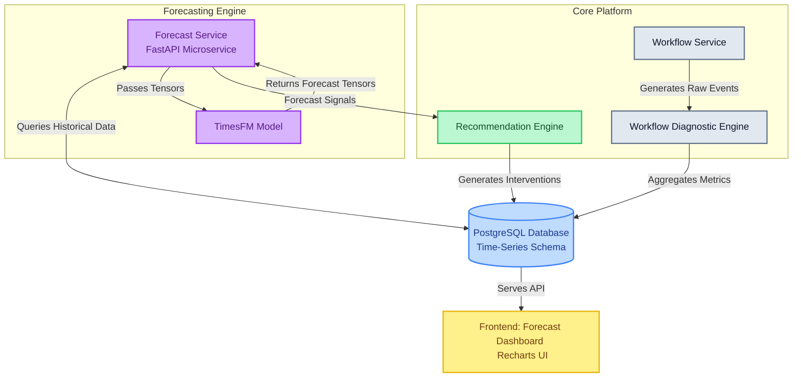

# TimesFM Forecasting Architecture

## 1. Architectural Overview

The Phase 5 Forecasting Layer introduces proactive operational intelligence to TARKAX. It relies on a decoupled, modular architecture designed around PostgreSQL for time-series data storage and a standalone FastAPI microservice to host the TimesFM model.

This design adheres to the strict constraint of avoiding premature platformization (no Kubernetes, Ray, or TimescaleDB) while ensuring that the forecast engine directly feeds the existing Recommendation Engine to drive operational decisions.



---

## 2. Model Serving Strategy

**Architecture:** A dedicated FastAPI microservice wrapper around TimesFM.

**Rationale:**
*   **Decoupling:** Isolates the heavy dependencies and specific Python environment required by TimesFM from the core TARKAX backend.
*   **Simplicity:** Aligns with the current non-orchestrated architecture. No Kubernetes or complex distributed systems required.
*   **Scalability:** Allows the forecast service to scale independently or be moved to specialized GPU hardware (if necessary) later, without touching the core application.

**Data Flow:**
1.  The core TARKAX backend requests a forecast for a specific `metric_id` and `horizon`.
2.  The FastAPI Forecast Service queries the PostgreSQL database for the historical time-series data for that metric.
3.  The Forecast Service formats the data into the tensor shapes required by TimesFM.
4.  TimesFM generates the forecast and confidence intervals.
5.  The Forecast Service processes the output and returns structured JSON to the core backend.
6.  The core backend stores the forecast and triggers the Recommendation Engine.

---

## 3. Database Schema (PostgreSQL)

We use standard PostgreSQL tables to handle time-series data, adhering to the constraint against introducing TimescaleDB at this stage.

### 3.1 `operational_metrics`
Defines the metrics being tracked and forecasted.

```sql
CREATE TABLE operational_metrics (
    id UUID PRIMARY KEY,
    organization_id UUID NOT NULL,
    workflow_id UUID NOT NULL,
    metric_name VARCHAR(255) NOT NULL, -- e.g., 'ticket_volume', 'approval_delay_hours'
    metric_type VARCHAR(50) NOT NULL,  -- e.g., 'capacity', 'bottleneck', 'risk', 'productivity'
    aggregation_frequency VARCHAR(50) DEFAULT 'daily', -- 'hourly', 'daily', 'weekly'
    created_at TIMESTAMP WITH TIME ZONE DEFAULT NOW(),
    updated_at TIMESTAMP WITH TIME ZONE DEFAULT NOW()
);
CREATE INDEX idx_metrics_org_workflow ON operational_metrics(organization_id, workflow_id);
```

### 3.2 `metric_timeseries_data`
Stores the aggregated historical data points.

```sql
CREATE TABLE metric_timeseries_data (
    id UUID PRIMARY KEY,
    metric_id UUID REFERENCES operational_metrics(id) ON DELETE CASCADE,
    timestamp TIMESTAMP WITH TIME ZONE NOT NULL,
    value DOUBLE PRECISION NOT NULL,
    created_at TIMESTAMP WITH TIME ZONE DEFAULT NOW()
);
-- Crucial for time-series querying performance in standard Postgres
CREATE INDEX idx_timeseries_metric_time ON metric_timeseries_data(metric_id, timestamp DESC);
```

### 3.3 `metric_forecasts`
Stores the generated forecasts and confidence intervals.

```sql
CREATE TABLE metric_forecasts (
    id UUID PRIMARY KEY,
    metric_id UUID REFERENCES operational_metrics(id) ON DELETE CASCADE,
    forecasted_for_timestamp TIMESTAMP WITH TIME ZONE NOT NULL,
    forecast_value DOUBLE PRECISION NOT NULL,
    confidence_lower_bound DOUBLE PRECISION,
    confidence_upper_bound DOUBLE PRECISION,
    confidence_level DOUBLE PRECISION, -- e.g., 0.90 for 90% confidence
    generated_at TIMESTAMP WITH TIME ZONE DEFAULT NOW()
);
CREATE INDEX idx_forecasts_metric_time ON metric_forecasts(metric_id, forecasted_for_timestamp);
```

---

## 4. API Design

### 4.1 Internal API (Forecast Service -> TimesFM)
The Forecast Service exposes a simple endpoint to the core TARKAX backend.

**`POST /api/internal/forecast/generate`**

**Request:**
```json
{
  "metric_id": "uuid",
  "horizon": 30,
  "confidence_levels": [0.8, 0.95]
}
```

**Response:**
```json
{
  "metric_id": "uuid",
  "horizon": 30,
  "forecasts": [
    {
      "timestamp": "2024-05-01T00:00:00Z",
      "value": 150.5,
      "intervals": {
        "80": {"lower": 140.0, "upper": 161.0},
        "95": {"lower": 130.5, "upper": 170.5}
      }
    }
  ]
}
```

### 4.2 External API (Frontend -> Core Backend)
The core backend serves data to the frontend dashboard.

**`GET /api/v1/workflows/{workflow_id}/forecasts?metric_id={uuid}`**

**Response:**
Returns historical data combined with forecast data to power the frontend charts.

```json
{
  "metric_metadata": {
    "name": "Ticket Volume",
    "type": "capacity"
  },
  "historical_data": [
    {"timestamp": "2024-04-28", "value": 120},
    {"timestamp": "2024-04-29", "value": 135}
  ],
  "forecast_data": [
    {
      "timestamp": "2024-04-30",
      "expected": 140,
      "lower_90": 130,
      "upper_90": 150
    }
  ],
  "recommendations": [
    {
      "id": "uuid",
      "message": "Forecast indicates ticket volume will exceed capacity in 7 days. Recommended action: Adjust on-call schedule.",
      "severity": "high"
    }
  ]
}
```

---

## 5. UI Architecture

The frontend will use **Recharts** to render the Forecast Dashboard. Recharts is chosen for its simplicity, maturity, and native React support, aligning perfectly with the current project constraints.

### 5.1 Forecast Dashboard Component
The dashboard will display:
1.  **Composite Line/Area Chart:**
    *   Solid line for historical data.
    *   Dashed line for forecasted mean values.
    *   Shaded area (`<Area />` component in Recharts) for confidence bands (e.g., 90% confidence interval).
2.  **Risk Alerts Panel:** Displays immediate warnings if the forecast breaches predefined operational thresholds (e.g., predicted capacity > 100%).
3.  **Recommendations Panel:** Displays actionable interventions generated by the Recommendation Engine based on the forecast.

### 5.2 Recharts Implementation Example (Conceptual)

```tsx
<ComposedChart data={chartData}>
  <XAxis dataKey="date" />
  <YAxis />
  <Tooltip />
  <Legend />

  {/* Confidence Band */}
  <Area
    type="monotone"
    dataKey="confidenceBand"
    stroke="none"
    fill="#e2e8f0"
  />

  {/* Historical Data */}
  <Line
    type="monotone"
    dataKey="historicalValue"
    stroke="#3b82f6"
    dot={false}
  />

  {/* Forecasted Mean */}
  <Line
    type="monotone"
    dataKey="forecastValue"
    stroke="#9333ea"
    strokeDasharray="5 5"
    dot={false}
  />
</ComposedChart>
```

---

## 6. Implementation Roadmap

### Phase 5.1: Data Foundation (Weeks 1-2)
*   **Goal:** Establish the historical data pipeline.
*   **Tasks:**
    *   Implement PostgreSQL schemas (`operational_metrics`, `metric_timeseries_data`).
    *   Build ingestion pipelines to convert raw workflow events into aggregated daily/hourly metrics.
    *   Backfill historical data for existing workflows.
*   **Effort:** Medium
*   **Dependencies:** Core backend database architecture.
*   **Risks:** Data sparsity in existing workflows may prevent immediate forecasting.
*   **Success Criteria:** Historical data is reliably aggregated and queryable via the core backend.

### Phase 5.2: TimesFM Service Development (Weeks 3-4)
*   **Goal:** Stand up the isolated forecasting microservice.
*   **Tasks:**
    *   Create a new FastAPI application separate from the core backend.
    *   Integrate the TimesFM model and required dependencies.
    *   Develop the internal API endpoint for forecast generation.
    *   Implement data serialization/deserialization for TimesFM tensors.
*   **Effort:** High
*   **Dependencies:** Access to Google's TimesFM repository; appropriate compute resources for local/dev testing.
*   **Risks:** TimesFM dependency conflicts; performance bottlenecks in tensor formatting.
*   **Success Criteria:** Forecast Service successfully receives a payload, generates a valid TimesFM forecast, and returns structured JSON.

### Phase 5.3: Integration & Recommendation Linking (Weeks 5-6)
*   **Goal:** Connect the forecast output to operational decisions.
*   **Tasks:**
    *   Implement the `metric_forecasts` schema.
    *   Build the core backend logic to request forecasts periodically (e.g., nightly cron job).
    *   **Crucial:** Update the Recommendation Engine to accept forecast signals and generate predictive recommendations.
*   **Effort:** Medium
*   **Dependencies:** Completion of Phases 5.1 and 5.2.
*   **Risks:** Generating too many noisy or unactionable recommendations.
*   **Success Criteria:** A forecasted bottleneck automatically generates a corresponding recommendation in the TARKAX backend.

### Phase 5.4: UI Dashboard & Visualization (Weeks 7-8)
*   **Goal:** Surface the forecasts and recommendations to the user.
*   **Tasks:**
    *   Develop the external APIs to serve combined historical/forecast data.
    *   Build the Recharts composite charts for the Forecast Dashboard.
    *   Integrate the "What Changed", "What To Expect", and "Recommended Actions" panels.
*   **Effort:** Low/Medium
*   **Dependencies:** Frontend Recharts library; completion of backend APIs.
*   **Risks:** Poor UI rendering of complex confidence bands.
*   **Success Criteria:** Users can view an interactive chart showing past data, future forecasts, and confidence intervals alongside actionable recommendations.
