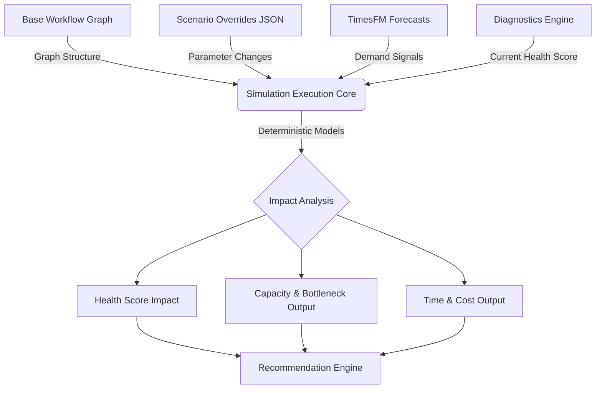

# Phase 7: Workflow Simulation Engine

## 1. Executive Summary
The TARKAX Workflow Simulation Engine (Phase 7) provides a deterministic, scenario-based modeling capability that allows users to answer the critical operational question: "What happens if we change the workflow?" Transitioning from retrospective diagnostics and forecasting into proactive operational simulation, this engine empowers users to compare different scenarios (e.g., changes in capacity, automation, governance, and demand) to identify optimal workflow designs. Following TARKAX's core principles, the MVP relies on explainable, deterministic analytical models rather than opaque probabilistic simulations, ensuring rapid deployment, high auditability, and immediate decision-support value.

## 2. Product Vision
The vision for the Workflow Simulation Engine is to serve as the ultimate operational sandbox. It shifts TARKAX from a system that tells you *how you are doing* (Diagnostics) or *what will happen* (Forecasting) to a system that allows you to *steer outcomes* (Simulation). By allowing decision-makers to evaluate the ROI, risk, and performance impact of workflow interventions before they are executed in the real world, TARKAX becomes an indispensable proactive command center.

## 3. MVP Scope
The Minimal Viable Product focuses exclusively on **parameter-based modifications** applied to existing workflow structures.

**Included in MVP:**
* Modification of task duration (e.g., reducing screening time).
* Modification of task cost.
* Modification of team/resource capacity (e.g., adding headcounts).
* Modification of approval delays.
* Modification of automation percentages.
* Modification of throughput assumptions.
* Deterministic analytical models (Little's Law, critical path analysis, bottleneck identification).
* Lightweight scenario storage via JSON configuration overrides.
* Comparison of up to 4 scenarios (Current State vs Scenario A, B, C).

**Explicitly Excluded from MVP:**
* Structural changes to the workflow graph (adding, removing, or reordering nodes).
* Discrete Event Simulation (DES) or Monte Carlo methods.
* Digital twins.
* Workflow forking or git-style database branching.

## 4. V1 Scope
Version 1 expands upon the MVP by introducing structural modifications and deeper integration with operational realities.

**Included in V1:**
* Structural modifications: Adding, removing, or reordering workflow steps.
* Simple workflow branching for scenarios.
* Expanded metric outputs (detailed compliance and risk impact tracking).
* Advanced comparison dashboards with visual graph overlays showing "what changed".

## 5. V2 Scope
Version 2 matures the simulation engine into a comprehensive operational modeling platform.

**Included in V2:**
* Discrete Event Simulation (DES) for modeling complex queueing behaviors over time.
* Monte Carlo simulations for probability-based outcome distributions.
* Dynamic workflow redesign recommendations generated by the system.
* Automated "goal-seeking" simulations (e.g., "Find the cheapest scenario that maintains a 5-day cycle time").

## 6. Architecture
The Simulation Engine integrates into the existing TARKAX architecture as an isolated calculation layer. It takes the base workflow structure, applies JSON-based scenario overrides, ingests demand signals from the TimesFM service, and passes the synthesized graph state into a deterministic mathematical engine.



## 7. Data Model
Scenarios are modeled as lightweight relational entities associated with a specific workflow and user, storing overrides as a `JSONB` blob.

```sql
CREATE TABLE workflow_scenarios (
    id UUID PRIMARY KEY DEFAULT uuid_generate_v4(),
    workflow_id UUID REFERENCES workflows(id) ON DELETE CASCADE,
    name VARCHAR(255) NOT NULL,
    description TEXT,
    created_by UUID REFERENCES users(id),
    base_snapshot_id UUID REFERENCES workflow_snapshots(id), -- Optional lock to a specific version
    overrides JSONB NOT NULL,
    created_at TIMESTAMP WITH TIME ZONE DEFAULT NOW(),
    updated_at TIMESTAMP WITH TIME ZONE DEFAULT NOW()
);
```

**JSON Override Structure Example:**
```json
{
  "node_overrides": {
    "node_uuid_123": {
      "duration_minutes": 15,
      "automation_percentage": 80
    },
    "node_uuid_456": {
      "cost_per_execution": 5.00
    }
  },
  "global_overrides": {
    "resource_capacity_multiplier": 1.2,
    "demand_volume_multiplier": 1.4
  }
}
```

## 8. Simulation Methodology
The MVP utilizes strictly deterministic analytical models.

1. **Little's Law (L = λW):**
   * Used to calculate expected backlog (L) based on TimesFM projected arrival rate/demand (λ) and calculated process cycle time (W).
2. **Critical Path Analysis:**
   * Determines the absolute minimum time a workflow takes. By reducing task durations on the critical path via scenario overrides, the total cycle time is recalculated.
3. **Bottleneck Identification & Capacity Analysis:**
   * Calculated by dividing total processing time per task by the allocated resource capacity. The node with the lowest throughput dictates the system's maximum capacity. Adding capacity overrides dynamically shifts the bottleneck to the next constrained node.
4. **Throughput Calculations:**
   * Determines maximum completed workflows per time period based on the bottleneck step.

## 9. Scenario Framework
Scenarios are categorized logically for users to structure their thinking:

* **Capacity Changes:** Simulating headcount adjustments (e.g., adding 2 support agents).
* **Automation Changes:** Adjusting the percentage of a task handled by AI or software vs. humans.
* **Governance Changes:** Modifying approval delays or SLA requirements.
* **Forecast-Based Changes:** Adjusting the baseline volume (via manual input or TimesFM integration) to stress-test the current configuration.

Users select a base state and define up to 3 alternative scenarios. The system runs the deterministic engine against all configurations concurrently to produce a side-by-side comparison matrix.

## 10. APQC Integration
Since all workflow nodes are mapped to APQC process groups (e.g., "10.2.1 Manage Customer Service Requests"), scenario overrides can be aggregated at the APQC hierarchy level.
* *Example:* If a scenario automates multiple steps within "10.2.1", the engine reports the total capacity impact and cost reduction specifically for that APQC capability, allowing standardized benchmarking against industry baselines.

## 11. TimesFM Integration
TimesFM acts strictly as a **demand signal input provider**. It does not participate in workflow logic.
* **Flow:** TimesFM forecasts a future metric (e.g., +40% ticket volume next month). This forecast is injected into the Simulation Engine as the `global_overrides.demand_volume_multiplier`. The deterministic engine then recalculates bottlenecks and backlogs based on the current (or altered) workflow capacity against the new expected volume.

## 12. Recommendation Engine Integration
The outputs of the Simulation Engine feed directly back into the Recommendation Engine.
* If a scenario successfully mitigates a forecasted bottleneck, the Recommendation Engine can suggest implementing the scenario's parameters (e.g., "Implement AI triage on Node B to prevent the Q4 SLA breach forecasted by TimesFM").
* Conversely, if the Diagnostics Engine flags a poor Workflow Health Score, the Recommendation Engine can auto-generate a lightweight Scenario (e.g., "Scenario: Recommended Fix") for the user to simulate and verify the proposed ROI.

## 13. API Design

**POST `/api/v1/workflows/{workflow_id}/simulate`**
Executes a comparison between the base workflow and provided scenarios.

*Request Body:*
```json
{
  "base_demand_rate": 100,
  "scenarios": [
    {
      "id": "scenario_a_uuid",
      "overrides": {
        "global_overrides": {
          "demand_volume_multiplier": 1.4
        }
      }
    },
    {
      "id": "scenario_b_uuid",
      "overrides": {
        "node_overrides": {
          "node_uuid_123": {
            "duration_minutes": 5
          }
        }
      }
    }
  ]
}
```

*Response Body:*
```json
{
  "results": {
    "baseline": {
      "cycle_time_minutes": 120,
      "max_throughput": 50,
      "bottleneck_node": "node_uuid_xyz",
      "health_score_impact": 0
    },
    "scenario_a_uuid": {
      "cycle_time_minutes": 120,
      "max_throughput": 50,
      "bottleneck_node": "node_uuid_xyz",
      "health_score_impact": -15,
      "confidence_score": 0.90,
      "backlog_warning": true
    },
    "scenario_b_uuid": {
      "cycle_time_minutes": 80,
      "max_throughput": 85,
      "bottleneck_node": "node_uuid_abc",
      "health_score_impact": +12,
      "confidence_score": 0.95
    }
  }
}
```

## 14. UI/UX Flow
1. **Selection:** User navigates to a specific Workflow detail page and clicks "Simulate Scenarios".
2. **Configuration:** The UI presents the baseline workflow metrics. A side panel allows the user to create "Scenario A".
3. **Parameter Overrides:** User clicks on specific nodes in the graph view to edit parameters (e.g., reduce duration from 10m to 2m) or adjusts global sliders (Demand, Capacity).
4. **Execution:** User clicks "Run Simulation".
5. **Comparison Board:** A tabular and visual interface displays Baseline vs. Scenario A side-by-side, highlighting delta values (e.g., Time-to-hire: 45 days -> 32 days, Cost: -$1,200).
6. **Action:** User can save the scenario, export the business case, or apply recommendations.

## 15. Implementation Roadmap

* **Phase 7.1: Foundational Engine (Weeks 1-2)**
  * Implement the deterministic math engine (Little's Law, critical path logic).
  * Build the `workflow_scenarios` database table and JSONB parsing logic.
* **Phase 7.2: API & Integration (Weeks 3-4)**
  * Expose simulation endpoints.
  * Integrate TimesFM demand signals as inputs.
  * Wire simulation outputs to the Workflow Health Score calculator.
* **Phase 7.3: Frontend UI (Weeks 5-6)**
  * Build Scenario creation side panel.
  * Implement the side-by-side comparison dashboard.
  * Integrate node-level parameter editing.
* **Phase 7.4: Refinement & Launch (Week 7)**
  * Add APQC aggregation reporting.
  * E2E testing and QA validation.
