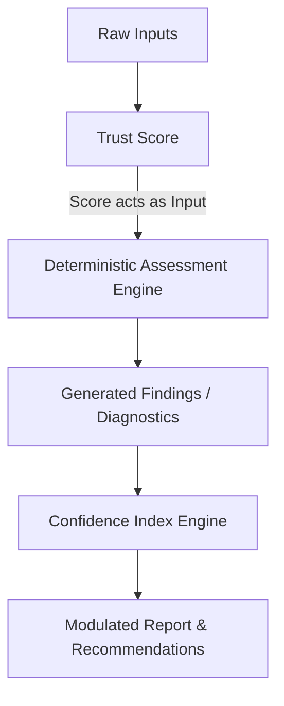

# TarkaX Confidence Index v1

## Executive Summary

The TarkaX Confidence Index is a deterministic architectural component designed to answer a single critical question: **"How trustworthy are the findings generated by TarkaX?"**

As TarkaX transitions from simple scoring models to deep Organizational Failure Intelligence, the platform must clearly distinguish between the quality of the inputs it receives and the reliability of the conclusions it generates. The Confidence Index acts as the final guardrail before insights are presented, governing the aggressiveness of recommendations, the certainty of forecasts, and the overall validity of the diagnostic report.

## Architectural Boundary: Trust Score vs. Confidence Index

To maintain auditable and explainable diagnostics, TarkaX enforces a strict separation between Input Validation and Output Validation.

*   **Trust Score:** Evaluates the *inputs*. It answers, **"Can we trust the data?"** (e.g., completeness, evidence presence, input length).
*   **Confidence Index:** Evaluates the *conclusions*. It answers, **"Can we trust the assessment conclusions?"** (e.g., corroboration, contradiction risk, benchmark reliability).

### Sequential Pipeline

## Confidence Index Dimensions

The Confidence Index is 100% deterministic, utilizing a weighted rules engine. It is never directly calculated by an LLM.

### Factors that do NOT influence confidence
*   **Organizational Health/Capability Score:** A company with "Fragile" capabilities can still have a 100% Confidence Index if they provided perfect evidence of their fragility.
*   **Assessment Speed:** How fast the user completed the assessment.
*   **Company Revenue or Size (Directly):** While demographic alignment matters for benchmarking, raw size does not dictate truthfulness.

### 1. Trust Score Inheritance (Weight: 25%)
*   **Definition:** The foundational reliability of the underlying data.
*   **Calculation Logic:** Normalization of the Trust Score output (which evaluates missing evidence, incomplete responses, and weak response length).
*   **Impact:** A poor Trust Score automatically bottlenecks the maximum possible Confidence Index.

### 2. Evidence Corroboration (Weight: 25%)
*   **Definition:** The degree to conclusion points are supported by independent or high-quality evidence types.
*   **Calculation Logic:** Scoring based on the Validation Layer levels (L1 Assertion Only to L5 Supporting Artifact). Higher aggregate validation levels across critical APQC nodes yield higher corroboration scores.

### 3. Internal Consistency & Contradiction Risk (Weight: 20%)
*   **Definition:** The absence of conflicting signals within the assessment findings.
*   **Calculation Logic:** Penalty-based scoring. Deterministic rules flag contradictions (e.g., claiming "Resilient Automation" while concurrently logging "No Dedicated Process Owner"). Each flag reduces the consistency score.

### 4. Benchmark Reliability & Coverage (Weight: 20%)
*   **Definition:** The statistical validity of comparing the current organization against the expected capabilities.
*   **Calculation Logic:** Evaluates if the organizational demographics (Industry, Size) map strongly to a robust, highly-populated benchmark cohort. Low cohort volume or missing demographic alignment lowers this score.

### 5. Node Criticality Coverage (Weight: 10%)
*   **Definition:** Ensuring the most heavily weighted APQC workflow nodes have sufficient data.
*   **Calculation Logic:** Ratio of high-criticality nodes with complete, high-trust data versus high-criticality nodes relying on default/fragile assumptions.

## Scoring Methodology

To satisfy both executives (who prefer hard numbers) and government/consulting stakeholders (who require qualitative interpretation), the Confidence Index generates two parallel outputs.

### Primary: Percentage-Based (0-100%)
A purely mathematical aggregation of the weighted dimensions.

*Example calculation:*
*   Trust Score Inheritance: 20/25
*   Evidence Corroboration: 15/25
*   Consistency: 18/20
*   Benchmark Reliability: 15/20
*   Node Criticality: 8/10
*   **Total Confidence Index: 76%**

### Secondary: Qualitative Banding
The percentage maps directly to a 5-level qualitative band:

*   **0–20%:** Very Low Confidence
*   **21–40%:** Low Confidence
*   **41–60%:** Moderate Confidence
*   **61–80%:** High Confidence
*   **81–100%:** Very High Confidence

## Output Examples

### Example 1: High Confidence
**AI Maturity:** Operational
**Confidence:** 82% (Very High Confidence)
**Reason:**
✓ Assessment completed
✓ Evidence provided
✓ No major contradictions
✓ Benchmark coverage available

### Example 2: Low Confidence
**Workflow Health:** 63
**Confidence:** 41% (Moderate Confidence)
**Reason:**
✗ Missing evidence
✗ Incomplete responses
✗ Contradictions detected

## Report Integration & Influence Logic

The Confidence Index is not merely a display metric; it is an operational governor. It actively alters the behavior, tone, and scope of specific TarkaX reports.

### Specific Audit Integrations

1.  **AI Audit:** If confidence is low due to lack of technical evidence (e.g., missing API specs), the report will restrict recommendations for custom LLM deployments and default to off-the-shelf suggestions, flagging the need for deeper technical verification.
2.  **Workflow Diagnostic:** Low confidence (often due to missing process owners or missing workflow maps) will prevent the simulation engine from generating aggressive cost-saving forecasts, instead outputting a recommendation to "Define current state workflow."
3.  **Leadership Audit:** Highly sensitive to "Contradiction Risk" (e.g., Leaders claim high alignment, but lower-level data contradicts). If the Confidence Index drops due to internal inconsistency, the report shifts from "Strategic Execution" to "Alignment Discovery."
4.  **Manager Audit:** Confidence hinges on L3/L4 evidence (Tool Context, Process Ownership). Low confidence restricts operational KPI forecasting.
5.  **Employee Audit:** Often relies on high-volume, lower-tier evidence (L1/L2). Confidence index scales based on participation rates. Low confidence triggers recommendations for "Broader organizational sampling."
6.  **Organizational Alignment Audit:** The ultimate aggregator. The Confidence Index here is a meta-score derived from the variance between Leadership, Manager, and Employee audits. High variance severely penalizes the Confidence Index, altering the report to focus strictly on resolving communication gaps rather than APQC optimizations.

### General Influence Logic Based on Thresholds
### High Confidence (>80%)
*   **Report Posture:** Authoritative and directive.
*   **Recommendations Allowed:** Strong, strategic, high-cost, and structural recommendations.
*   **Forecasting:** Aggressive, long-term forecasting enabled.
*   **Display:** Prominently displayed as a badge of assessment rigor.

### Moderate Confidence (50-80%)
*   **Report Posture:** Advisory.
*   **Recommendations Allowed:** Moderate, operational adjustments. High-cost strategic changes are withheld or flagged as "requiring further validation".
*   **Forecasting:** Limited to short-term operational impacts.
*   **Display:** Displayed with contextual notes on which areas lack corroboration.

### Low Confidence (<50%)
*   **Report Posture:** Cautious and exploratory.
*   **Recommendations Allowed:** Restricted exclusively to data-gathering tasks and minor localized fixes. No strategic or high-cost recommendations are generated.
*   **Forecasting:** Disabled or heavily caveats.
*   **Display:** Replaces confident assertions with "Additional evidence recommended to validate finding."

## Risk Analysis

| Risk Type | Description | Mitigation Strategy |
| :--- | :--- | :--- |
| **Gamification** | Users optimizing inputs to achieve a "High Confidence" score rather than providing truthful data. | **Hidden from Respondent:** The Confidence Index (and the underlying Trust Score) must *never* be displayed during the assessment phase. Use generic prompts ("Provide an example") instead. |
| **False Confidence** | The system reports High Confidence because inputs are structurally perfect, but the evidence is purely fabricated. | **Validation Layer Synergy:** Rely on L4/L5 evidence requirements for high critical nodes. In future phases, AI signals will strictly flag semantic inconsistencies to feed the deterministic penalty rules. |
| **False Low-Confidence** | Valid, novel operational models are flagged as "Contradictory" simply because they deviate from standard APQC norms. | **Contextual Exceptions:** Ensure contradiction rules evaluate "risk" rather than just "deviation". Deviations with L5 evidence should override standard contradiction penalties. |

## Implementation Analysis (Architecture Overview)

*Note: This is an architectural blueprint. No code implementation is performed in this phase.*

### 1. Architecture
The Confidence Engine sits between the Diagnostic Engine (L3) and the Recommendation/Intelligence Layer (L4/L5). It operates as an asynchronous, deterministic rules engine that processes the generated findings payload before it is handed off to the report generator.

### 2. Data Requirements
*   Final Output Payload from Diagnostic Engine.
*   Aggregate Trust Score from L2 Validation Layer.
*   List of triggered Contradiction Flags.
*   Benchmark Cohort metadata (N-count, demographic alignment score).

### 3. Database Implications (PostgreSQL / Supabase)
*   Do not use large JSONB blobs for the core scoring dimensions.
*   Required structured tables (Conceptual):
    *   `assessment_confidence_runs` (id, assessment_id, total_score, band, created_at)
    *   `confidence_dimension_scores` (id, run_id, dimension_name, points_awarded, max_points)
    *   `confidence_penalties` (id, run_id, penalty_type, points_deducted, reason)

### 4. API Implications
*   The Reporting API must accept the Confidence Index as a parameter to structurally filter the `recommendations` and `forecasts` arrays before returning them to the frontend.

### 5. Frontend Implications
*   **Assessment View:** Zero visibility. Do not leak the score.
*   **Report View:** Requires a dedicated UI component in the report header (e.g., using Recharts for a gauge or confidence band) to display the score, band, and a breakdown of the *Reasons* (e.g., "✓ No major contradictions", "✗ Missing evidence for critical nodes").

### 6. AI Integration Boundary
*   Current Phase: 100% Deterministic.
*   Future Phase: AI models (LLMs) may generate "Signals" (e.g., `semantic_consistency_flag: true`). These signals are strictly routed as boolean inputs into the deterministic penalty engine. The LLM *never* outputs a confidence number.