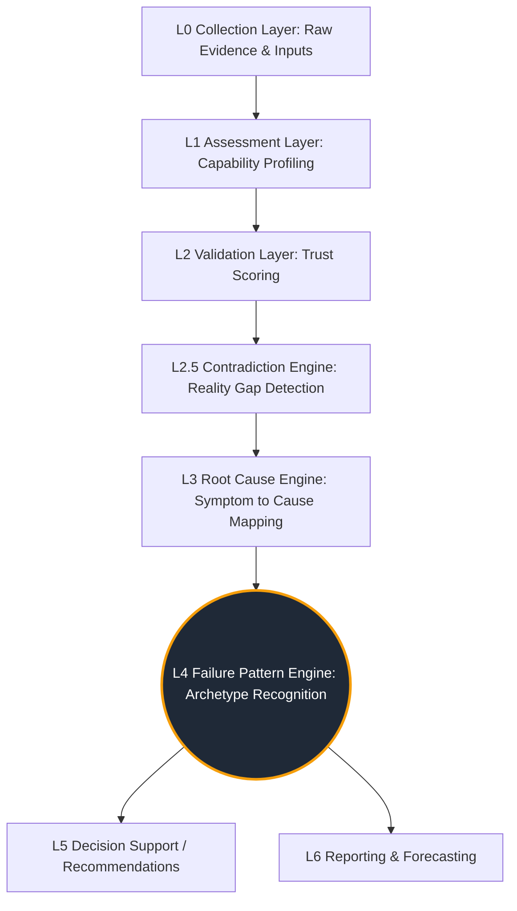
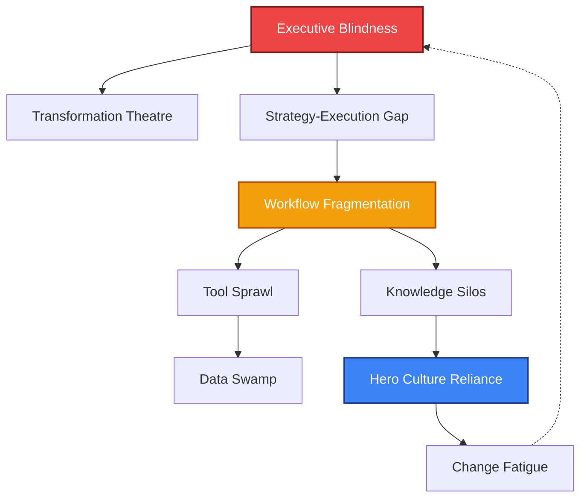
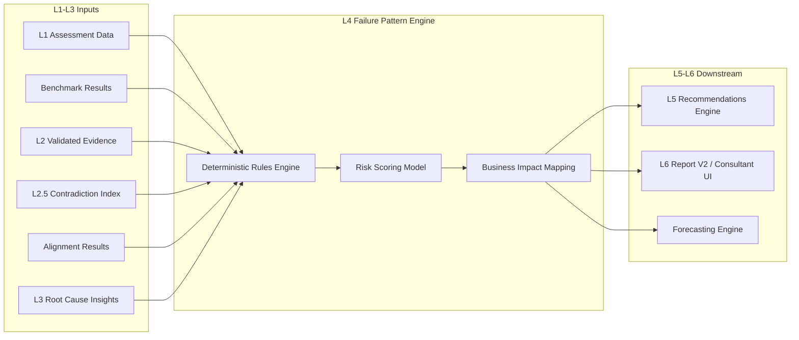
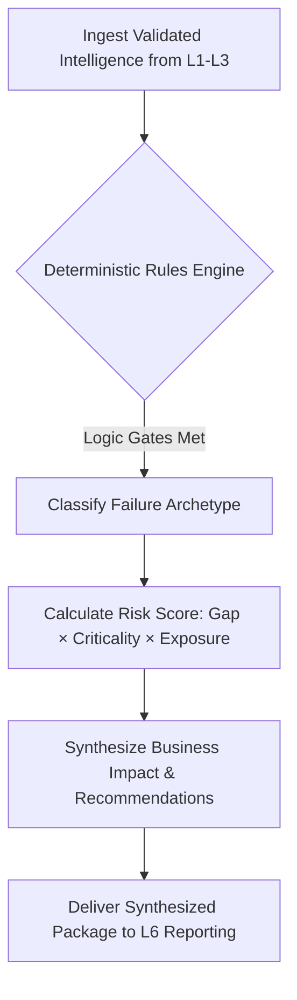

# TarkaX: Failure Pattern Engine v1 (Framework)

## 1. Executive Summary
The TarkaX Failure Pattern Engine (L4 Intelligence) is a deterministic diagnostic system designed to identify, categorize, and prioritize recurring organizational failure archetypes from assessment data. Operating strictly as an intelligence layer above the core workflow and APQC ontological structures, it seeks to answer the fundamental question: *"Why is this process failing?"*
Moving beyond generic score calculations and anomaly detection, this framework is designed to replicate the diagnostic reasoning of a top-tier management consultancy. By consuming verified intelligence from upstream layers (L0 Collection, L1 Assessment, L2 Validation, L2.5 Contradiction, and L3 Root Cause), the engine classifies organizational symptoms into recognizable, actionable archetypes (e.g., *Shadow AI*, *Executive Blindness*, *Tool Sprawl*). This intelligence empowers decision-makers with explainable risk scoring, business impact modeling, and targeted 30/60/90-day recommendation frameworks.
### 1.1 Architecture Layering Context
The Failure Pattern Engine exists strictly at **L4 Intelligence**. It does not operate on raw assessment inputs.

### 1.2 Separation of Ontology: APQC vs. Failure Patterns
TarkaX maintains a strict separation between *Process Ontology* and *Failure Ontology*.
- **APQC Ontology** defines *What process is being executed* (e.g., Accounts Payable, Incident Management).
- **Failure Pattern Engine** defines *Why the process is failing* (e.g., Approval Bottlenecks, Knowledge Silos).
A single failure pattern can afflict dozens of distinct APQC workflows across an organization.
## 2. Comprehensive Failure Pattern Taxonomy (Part A)
This library establishes 30 distinct organizational failure archetypes, categorized by strategic domain.
### 2.1 AI Transformation Failures
1. **Shadow AI**
   * **Description**: Unauthorized or undocumented use of AI tools by individuals or departments.
   * **Symptoms**: Unaccounted software spend, inconsistent output formats, varying adherence to data privacy.
   * **Root Causes**: Strict legacy IT procurement, lack of enterprise AI tooling, pressure for high productivity.
   * **Risk Areas**: Compliance, Data Security, Reputational.
2. **Automation Without Adoption**
   * **Description**: Expensive automation systems are deployed but users revert to manual workarounds.
   * **Symptoms**: High initial CapEx with low utilization, parallel manual processes, user complaints regarding UX.
   * **Root Causes**: Poor Change Management, lack of user-centric design, failure to address daily workflow friction.
   * **Risk Areas**: Financial, Operational, Human Capital.
3. **Data Hallucination Reliance**
   * **Description**: Core business decisions are made based on unvalidated generative AI outputs.
   * **Symptoms**: Errors in automated reports, confident but incorrect strategic claims, lack of human-in-the-loop review.
   * **Root Causes**: Over-trust in nascent technology, absence of L2 Validation layers, lack of AI literacy.
   * **Risk Areas**: Strategic, Operational, Reputational.
### 2.2 Operational & Process Failures
4. **Approval Bottlenecks**
   * **Description**: Workflows stall due to an excessive number of mandatory sign-offs.
   * **Symptoms**: Long cycle times, expired vendor quotes, high WIP (Work in Progress), frustrated stakeholders.
   * **Root Causes**: Lack of delegated authority, high-risk aversion, legacy hierarchical structures.
   * **Risk Areas**: Operational, Strategic.
5. **Workflow Fragmentation**
   * **Description**: End-to-end processes are broken across multiple unintegrated teams or tools.
   * **Symptoms**: Data reentry errors, lost context between handoffs, "black hole" status inquiries.
   * **Root Causes**: Siloed departmental purchasing, lack of enterprise architecture, organic unstructured growth.
   * **Risk Areas**: Operational, Human Capital.
6. **Process Petrification**
   * **Description**: Rigid adherence to historical processes long after the original business rationale has expired.
   * **Symptoms**: "We've always done it this way," unnecessary steps in workflows, inability to respond to market changes.
   * **Root Causes**: Lack of continuous improvement culture, fear of non-compliance, orphaned process ownership.
   * **Risk Areas**: Operational, Strategic.
7. **Hero Culture Reliance**
   * **Description**: Operations depend entirely on a few highly skilled, over-worked individuals to prevent failure.
   * **Symptoms**: Operations halt when specific individuals are on leave, chronic burnout among key staff.
   * **Root Causes**: Lack of standardized training, undocumented institutional knowledge, chronic understaffing.
   * **Risk Areas**: Human Capital, Operational.
### 2.3 Leadership & Governance Failures
8. **Executive Blindness**
   * **Description**: Leadership makes decisions based on idealized, green-shifted reporting rather than operational reality.
   * **Symptoms**: 100% "Green" status reports masking critical issues, surprise catastrophic failures, massive L2.5 Contradictions.
   * **Root Causes**: Punitive culture for reporting bad news, lack of objective L0 Evidence Collection, excessive metric abstraction.
   * **Risk Areas**: Strategic, Financial.
9. **Transformation Theatre**
   * **Description**: High-visibility change initiatives that generate artifacts (logos, charters) but no actual operational change.
   * **Symptoms**: Excessive steering committee meetings, beautiful slide decks with no measurable KPI improvement.
   * **Root Causes**: Lack of clear success metrics, misaligned incentives, treating transformation as a project rather than capability building.
   * **Risk Areas**: Financial, Strategic, Reputational.
10. **Governance Theatre**
    * **Description**: Extensive policy documentation exists, but zero enforcement or compliance checking occurs in reality.
    * **Symptoms**: Perfect L1 self-assessment scores directly contradicted by zero L0/L2 evidence, widespread policy violations in practice.
    * **Root Causes**: Disconnect between policy authors and operations, lack of audit tooling, impossible compliance demands.
    * **Risk Areas**: Compliance, Reputational.
11. **Strategy-Execution Gap**
    * **Description**: Clear strategic goals exist, but operational teams lack the budget, tools, or mandate to execute them.
    * **Symptoms**: Unmet OKRs, strategic projects starved of resources, frontline confusion regarding priorities.
    * **Root Causes**: Poor resource allocation, lack of middle-management translation, siloed budgeting.
    * **Risk Areas**: Strategic, Financial.
### 2.4 Knowledge & Communication Failures
12. **Knowledge Silos**
    * **Description**: Critical operational data is trapped within specific departments, regions, or individual minds.
    * **Symptoms**: Duplication of effort across teams, inability to find "single source of truth," inconsistent customer experiences.
    * **Root Causes**: Tribal culture, unintegrated knowledge management platforms, lack of incentive to share.
    * **Risk Areas**: Operational, Human Capital.
13. **Meeting Overload**
    * **Description**: Communication defaults to synchronous meetings due to a lack of asynchronous decision frameworks.
    * **Symptoms**: Calendars double-booked, lack of deep work time, decisions delayed until the next committee meeting.
    * **Root Causes**: Fear of unilateral decision-making, poorly structured asynchronous tools, cultural expectation of consensus.
    * **Risk Areas**: Human Capital, Operational.
14. **Toxic Positivity Reporting**
    * **Description**: A communication culture where raising risks or forecasting failure is viewed as "not being a team player."
    * **Symptoms**: Risks are downplayed until they become crises, absence of documented mitigation plans.
    * **Root Causes**: Insecure leadership, incentive structures tied purely to success metrics, lack of psychological safety.
    * **Risk Areas**: Strategic, Operational, Reputational.
15. **Context Collapse**
    * **Description**: High-level directives reach the frontline without the underlying rationale or localized instruction.
    * **Symptoms**: Frontline misinterpretation of policy, malicious compliance, drop in employee engagement.
    * **Root Causes**: Over-reliance on email blasts for change management, lack of feedback loops.
   * **Risk Areas**: Operational, Human Capital.
### 2.5 Technology & Tooling Failures
16. **Tool Sprawl**
    * **Description**: Proliferation of overlapping, redundant software applications across the enterprise.
    * **Symptoms**: Multiple project management tools in use, high SaaS licensing costs, employee confusion over "where does this go?"
    * **Root Causes**: Decentralized purchasing, lack of enterprise architecture enforcement, failure to decommission legacy tools.
    * **Risk Areas**: Financial, Operational.
17. **Vendor Dependency (Lock-in)**
    * **Description**: Critical organizational capabilities are entirely controlled by a third-party vendor with punitive exit costs.
    * **Symptoms**: Spiraling renewal costs, inability to export data cleanly, product roadmap dictated by vendor priorities.
    * **Root Causes**: Poor initial procurement diligence, lack of internal technical capability, proprietary data formats.
    * **Risk Areas**: Financial, Strategic.
18. **Zombie Systems**
    * **Description**: Legacy systems that run critical but misunderstood processes, which no one dares to update or decommission.
    * **Symptoms**: Fear of touching specific servers/codebases, lack of vendor support, massive security vulnerabilities.
    * **Root Causes**: Loss of original architects, high perceived risk of migration, chronic underinvestment in IT debt.
    * **Risk Areas**: Operational, Compliance, Security.
19. **Data Swamp**
    * **Description**: Massive amounts of data are collected but are uncurated, unstructured, and unusable for intelligence.
    * **Symptoms**: High storage costs, inability to generate timely reports, low trust in data outputs.
    * **Root Causes**: "Collect everything" mindset without data governance, lack of clear data models, missing data stewardship.
   * **Risk Areas**: Financial, Strategic.
### 2.6 Change & Transformation Failures
20. **Change Fatigue**
    * **Description**: Employees actively resist new initiatives due to a history of constant, overlapping, and failed transformations.
    * **Symptoms**: Apathy during rollouts, low adoption rates of new tools, vocal cynicism.
    * **Root Causes**: Lack of prioritization by leadership, failure to land previous changes before starting new ones, ignoring human capacity.
    * **Risk Areas**: Human Capital, Strategic.
21. **Training as a Panacea**
    * **Description**: Attempting to solve systemic workflow or tooling issues by simply mandating more employee training.
    * **Symptoms**: High training costs with zero improvement in error rates, user complaints about broken processes.
    * **Root Causes**: Misidentifying process flaws as skill gaps, unwillingness to redesign bad UX.
    * **Risk Areas**: Operational, Financial.
22. **Misaligned Incentives**
    * **Description**: Employees are rewarded for behaviors that actively damage the long-term strategic goal.
    * **Symptoms**: Sales teams selling undeliverable features, customer service optimizing for call speed over resolution.
    * **Root Causes**: Poorly designed KPI structures, lack of systemic thinking during performance review design.
    * **Risk Areas**: Strategic, Reputational.
### 2.7 Resiliency & Risk Failures
23. **Single Point of Failure (SPOF) Architecture**
    * **Description**: Critical business functions rely on a single vendor, facility, or supply chain node.
    * **Symptoms**: Panic during minor outages, lack of tested disaster recovery plans.
    * **Root Causes**: Over-optimization for cost (e.g., just-in-time) at the expense of resiliency, lack of risk mapping.
   * **Risk Areas**: Operational, Financial.
24. **Compliance as a Checkbox**
    * **Description**: Security and compliance activities are treated as paperwork exercises rather than actual risk mitigation.
    * **Symptoms**: Passing audits but suffering breaches, security policies that exist only on paper.
    * **Root Causes**: View of compliance as a cost center, lack of embedded security culture.
    * **Risk Areas**: Compliance, Reputational, Financial.
25. **Deferred Maintenance Debt**
    * **Description**: Systematic delaying of necessary infrastructure, software, or equipment upgrades to hit short-term financial targets.
    * **Symptoms**: Increasing frequency of breakdowns, sudden massive CapEx requirements, degraded performance.
    * **Root Causes**: Short-term financial incentives for leadership, lack of lifecycle asset management.
   * **Risk Areas**: Financial, Operational.
### 2.8 Customer & Market Focus Failures
26. **Inside-Out Design**
    * **Description**: Products and services are designed around internal organizational silos rather than the customer journey.
    * **Symptoms**: Customers having to repeat information to different departments, disjointed user experiences.
    * **Root Causes**: Rigid organizational structures dictating product design (Conway's Law), lack of customer research.
    * **Risk Areas**: Reputational, Strategic.
27. **Metric Manipulation**
    * **Description**: Teams alter data or definitions to meet targets rather than improving the actual underlying performance.
    * **Symptoms**: "Watermelon metrics" (green on the outside, red on the inside), gaming the system.
    * **Root Causes**: Unrealistic top-down targets, punitive management styles, lack of independent data auditing.
    * **Risk Areas**: Strategic, Operational.
28. **Feature Factory Syndrome**
    * **Description**: Product teams are measured purely on output volume (features shipped) rather than business outcomes.
    * **Symptoms**: Bloated software, low usage of new features, rising technical debt.
    * **Root Causes**: Lack of product strategy, equating motion with progress.
   * **Risk Areas**: Strategic, Financial.
29. **Feedback Blackhole**
    * **Description**: Customer or employee feedback is rigorously collected but never acted upon or acknowledged.
    * **Symptoms**: Declining survey response rates, repeated identical complaints over time.
    * **Root Causes**: Unconnected systems between survey tools and product roadmaps, lack of dedicated follow-up teams.
    * **Risk Areas**: Reputational, Human Capital.
30. **Innovation Theater**
    * **Description**: Creation of innovation labs or hackathons that generate PR but fail to integrate any findings into core operations.
    * **Symptoms**: "Cool" prototypes that never see production, frustration from top talent.
    * **Root Causes**: Isolating innovation from the core business P&L, lack of commercialization pathways.
   * **Risk Areas**: Strategic, Financial.
## 3. Core Archetype Deep-Dives (Part B)
The following 10 patterns represent the most critical, high-frequency organizational failures. These are the initial implementation candidates for the Failure Pattern Engine v1.
### 3.1 Shadow AI
* **Example Output**: "Organization exhibits Critical risk of Shadow AI. Evidence shows 45% of surveyed employees utilizing unsanctioned Generative AI tools to process internal data, while the IT catalog lists 0 approved AI applications. Combine this with Low Policy Awareness (L1 Assessment score: 2/5), and there is severe compliance exposure."
* **Detection Logic (Deterministic)**:
* **Detection Logic (Deterministic)**:
  * `IF` (Employee Survey: AI Tool Usage > 40%)
  * `AND` (IT Tool Inventory: Approved AI Tools < 2)
  * `AND` (Governance Assessment: AI Policy Awareness = Low)
  * `THEN` Trigger: Shadow AI
* **Required Inputs**: L1 Assessment (Governance, Policy), L0 Evidence (Tool Inventory, Employee Surveys).
* **Risk Scoring**:
* **Risk Scoring**:
  * Capability Gap (High) × Business Criticality (High - Data Security) × Failure Exposure (High - Unregulated PII ingestion) = **Critical**.
* **Business Impact**: Severe compliance risk (GDPR/HIPAA violations), IP leakage, inconsistent decision-making frameworks.
* **Recommendation Framework**:
* **Recommendation Framework**:
  * **Immediate**: Issue enterprise-wide communication clarifying acceptable AI use; audit firewall logs for high-traffic unapproved AI domains.
  * **30-Day**: Fast-track procurement of a secure, enterprise-walled GenAI sandbox.
  * **60-Day**: Implement an "AI Amnesty" program to uncover current use cases without penalizing employees.
  * **90-Day**: Establish a cross-functional AI Governance Board.
### 3.2 Tool Sprawl
* **Example Output**: "Organization exhibits Moderate-to-High risk of Tool Sprawl. Evidence indicates 25 distinct SaaS applications utilized per 100 employees, with severe redundancy identified in Project Management capabilities (4 overlapping tools). This fragmentation causes operational inefficiency and wasted OpEx."
* **Detection Logic (Deterministic)**:
  * `IF` (Distinct SaaS apps per 100 employees > Threshold [e.g., 20])
  * `AND` (Category Overlap > 3 [e.g., 3 different project management tools])
  * `AND` (L3 Root Cause identifies "Decentralized Purchasing")
  * `THEN` Trigger: Tool Sprawl
* **Required Inputs**: IT Procurement logs, APQC Workflow tooling maps.
* **Risk Scoring**:
  * Capability Gap (Moderate) × Business Criticality (Moderate) × Failure Exposure (High - Financial waste) = **Moderate to High**.
* **Business Impact**: High OPEX waste, fragmented data, high onboarding time, increased attack surface.
* **Recommendation Framework**:
  * **Immediate**: Implement a hard freeze on net-new SaaS purchases without Architecture Review Board approval.
  * **30-Day**: Conduct a comprehensive SaaS inventory and map to APQC capabilities.
  * **60-Day**: Identify redundant tools and announce retirement dates for the lowest-adopted platforms.
  * **90-Day**: Migrate workflows to enterprise-standard platforms and revoke legacy access.
### 3.3 Executive Blindness
* **Example Output**: "Organization exhibits Critical risk of Executive Blindness. A massive reality gap exists: leadership perceives Operations at a Resilient Level (5/5), but frontline evidence indicates Fragile (1/5) maturity. Upward KPI reporting is masking significant downstream bottlenecks."
* **Detection Logic (Deterministic)**:
  * `IF` (L2.5 Contradiction Engine detects massive delta between Executive Perception [Green/Score > 80] AND Employee Reality [Red/Score < 40])
  * `AND` (KPIs reported upwards are consistently met while L0 operational evidence shows bottlenecks)
  * `THEN` Trigger: Executive Blindness
* **Required Inputs**: L2.5 Contradiction Index, Multi-tier survey data.
* **Risk Scoring**:
* **Risk Scoring**:
  * Capability Gap (High) × Business Criticality (Critical) × Failure Exposure (High) = **Critical**.
* **Business Impact**: Strategic failure due to misallocation of resources; sudden catastrophic operational failures that leadership did not foresee.
* **Recommendation Framework**:
  * **Immediate**: Require L0 Evidence links for all "Green" status reports on tier-1 strategic initiatives.
  * **30-Day**: Implement skip-level meetings and anonymous frontline feedback loops.
  * **60-Day**: Redesign executive dashboards to include L2 Validation Trust Scores alongside KPIs.
  * **90-Day**: Tie leadership compensation partially to the accuracy of organizational forecasting, not just hitting targets.
### 3.4 Approval Bottlenecks
* **Example Output**: "Organization exhibits High risk of Approval Bottlenecks. 55% of the end-to-end Procurement cycle time is consumed strictly by wait-times for Director-level sign-offs, yet rejection rates are < 2%, indicating rubber-stamping rather than genuine risk mitigation."
* **Detection Logic (Deterministic)**:
  * `IF` (Workflow Graph Edge Analysis shows node wait-time > 50% of total cycle time)
  * `AND` (Node type = "Manager Approval" or "Legal Review")
  * `AND` (Approval Rejection Rate < 5% [indicating rubber-stamping])
  * `THEN` Trigger: Approval Bottlenecks
* **Required Inputs**: APQC Workflow metadata, L0 cycle time evidence.
* **Risk Scoring**:
  * Capability Gap (Moderate) × Business Criticality (High) × Failure Exposure (Moderate) = **High**.
* **Business Impact**: Lost revenue opportunities (slow sales cycle), high cost-to-serve, reduced organizational agility.
* **Recommendation Framework**:
  * **Immediate**: Identify the top 3 slowest approval nodes and document their business rationale.
  * **30-Day**: Implement threshold-based auto-approvals (e.g., purchases under $5k auto-approve).
  * **60-Day**: Shift from pre-approval to post-audit models for low-risk workflows.
  * **90-Day**: Redesign delegation of authority matrix to empower frontline decision-making.
### 3.5 Knowledge Silos
* **Example Output**: "Organization exhibits High risk of Knowledge Silos. Core documentation is heavily reliant on Tribal Knowledge, and cross-departmental APQC mappings reveal a significant drop-off in data visibility during inter-team handoffs."
* **Detection Logic (Deterministic)**:
  * `IF` (L1 Assessment identifies "Tribal Knowledge" as primary documentation method)
  * `AND` (Cross-department workflow maps show missing data handoffs)
  * `AND` (L0 Evidence: High search time or duplication of artifacts)
  * `THEN` Trigger: Knowledge Silos
* **Required Inputs**: Process documentation evidence, cross-functional APQC mapping.
* **Risk Scoring**:
  * Capability Gap (High) × Business Criticality (Moderate) × Failure Exposure (Moderate) = **High**.
* **Business Impact**: Inefficient onboarding, loss of IP when key personnel leave, inconsistent customer service.
* **Recommendation Framework**:
  * **Immediate**: Mandate central repository usage for all tier-1 project documentation.
  * **30-Day**: Identify key "knowledge brokers" (SMEs) and allocate 10% of their time to documentation.
  * **60-Day**: Implement enterprise search capabilities across fragmented repositories.
  * **90-Day**: Tie knowledge contribution metrics to annual performance reviews.
### 3.6 Workflow Fragmentation
* **Example Output**: "Organization exhibits Critical risk of Workflow Fragmentation. The Order-to-Cash process traverses 5 independent IT systems with 0 API integration, requiring manual CSV exports to bridge the data gaps, significantly increasing error exposure."
* **Detection Logic (Deterministic)**:
  * `IF` (End-to-end APQC process traverses > 4 distinct systems without API integration)
  * `AND` (Evidence shows manual data export/import steps via CSV/Excel)
  * `THEN` Trigger: Workflow Fragmentation
* **Required Inputs**: Workflow graphs, system integration assessments.
* **Risk Scoring**:
  * Capability Gap (High) × Business Criticality (High) × Failure Exposure (High - Data integrity) = **Critical**.
* **Business Impact**: High error rates, massive invisible labor costs (data wrangling), inability to automate.
* **Recommendation Framework**:
  * **Immediate**: Map the highest-volume fragmented workflow end-to-end to quantify the manual labor cost.
  * **30-Day**: Deploy RPA (Robotic Process Automation) as a temporary band-aid for the most painful data entry steps.
  * **60-Day**: Build API integrations for the core system handoffs.
  * **90-Day**: Re-architect the process to eliminate unnecessary systems entirely.
### 3.7 Governance Theatre
* **Example Output**: "Organization exhibits Critical risk of Governance Theatre. While L1 policy self-assessments claim 95% compliance, L2 Validation found verifiable enforcement artifacts for only 15% of those policies, indicating a culture of checkbox compliance rather than genuine risk management."
* **Detection Logic (Deterministic)**:
  * `IF` (Policy completeness score > 90%)
  * `AND` (L2 Validation identifies < 20% of policies have verifiable enforcement artifacts/audit logs)
  * `THEN` Trigger: Governance Theatre
* **Required Inputs**: Policy document metadata, L2 Validation Evidence Status ("No Evidence Available").
* **Risk Scoring**:
  * Capability Gap (High) × Business Criticality (Critical - Compliance) × Failure Exposure (High) = **Critical**.
* **Business Impact**: Illusion of security leading to catastrophic breaches, failed regulatory audits, severe fines.
* **Recommendation Framework**:
  * **Immediate**: Pause creation of new policies; initiate reality-check audits on top 5 critical risk policies.
  * **30-Day**: Implement automated compliance checks (e.g., continuous control monitoring) rather than manual attestation.
  * **60-Day**: Archive unenforceable policies.
  * **90-Day**: Shift compliance accountability from the risk team directly to the business unit owners.
### 3.8 Transformation Theatre
* **Example Output**: "Organization exhibits High risk of Transformation Theatre. Despite millions in CapEx over 18 months, the underlying capability maturity has remained static. Copious project management artifacts exist, but operational process owners report zero changes in daily workflows."
* **Detection Logic (Deterministic)**:
  * `IF` (Transformation project budget/duration > Threshold)
  * `AND` (L1 Assessment shows no change in underlying capability maturity after 12 months)
  * `AND` (High volume of project artifacts but zero operational workflow changes)
  * `THEN` Trigger: Transformation Theatre
* **Required Inputs**: Strategic initiative tracking, baseline vs. current L1 Assessment maturity.
* **Risk Scoring**:
  * Capability Gap (Moderate) × Business Criticality (High) × Failure Exposure (Low immediate, High long-term) = **High**.
* **Business Impact**: Massive capital waste, severe change fatigue among employees, loss of market competitiveness.
* **Recommendation Framework**:
  * **Immediate**: Suspend steering committee meetings and demand proof of one operational KPI improvement.
  * **30-Day**: Re-baseline transformation goals away from "deliverables" (e.g., new software deployed) to "outcomes" (e.g., cycle time reduced by 20%).
  * **60-Day**: Replace project managers with operational process owners to lead the change.
  * **90-Day**: Implement hard phase-gates; cancel funding if operational adoption metrics are not met.
### 3.9 Hero Culture Reliance
* **Example Output**: "Organization exhibits High risk of Hero Culture Reliance. Critical process execution is heavily bottlenecked through just 3 individuals (representing 4% of the department). A lack of SOPs means their absence would immediately halt operations."
* **Detection Logic (Deterministic)**:
  * `IF` (Workflow node ownership analysis shows high centralization [>30% of critical paths rely on <5% of staff])
  * `AND` (L0 Evidence: High utilization rates, lack of documented SOPs for those nodes)
  * `THEN` Trigger: Hero Culture Reliance
* **Required Inputs**: Workflow RACI matrices, Resource allocation data, L1 Documentation maturity.
* **Risk Scoring**:
  * Capability Gap (High) × Business Criticality (High) × Failure Exposure (Moderate - tied to specific personnel) = **High**.
* **Business Impact**: Severe operational brittleness, inability to scale, eventual catastrophic burnout of key talent.
* **Recommendation Framework**:
  * **Immediate**: Mandate mandatory "shadowing" for the top 3 most critical "heroes."
  * **30-Day**: Enforce a mandatory 2-week continuous vacation for key personnel to stress-test system resiliency.
  * **60-Day**: Build comprehensive SOPs for the most critical centralized workflows.
  * **90-Day**: Redesign team structures to ensure N+1 redundancy for all critical capabilities.
### 3.10 Change Fatigue
* **Example Output**: "Organization exhibits Moderate-to-High risk of Change Fatigue. Frontline workers are currently subjected to 4 overlapping enterprise rollouts. Combined with historically poor adoption rates (<35%), this indicates the organization has exceeded its change absorption capacity."
* **Detection Logic (Deterministic)**:
  * `IF` (Number of concurrent enterprise initiatives impacting the frontline > 3)
  * `AND` (Employee survey indicates low capacity for change or high apathy)
  * `AND` (Adoption rates of the last 2 rollouts < 40%)
  * `THEN` Trigger: Change Fatigue
* **Required Inputs**: Strategic initiative portfolio, Employee engagement surveys, Tool adoption metrics.
* **Risk Scoring**:
  * Capability Gap (Moderate) × Business Criticality (Moderate) × Failure Exposure (High) = **Moderate to High**.
* **Business Impact**: Failed ROI on strategic investments, high employee turnover, loss of organizational agility.
* **Recommendation Framework**:
  * **Immediate**: Implement an enterprise "change freeze" for all non-regulatory initiatives.
  * **30-Day**: Force leadership to rank-order initiatives; eliminate the bottom 30% to free up organizational capacity.
  * **60-Day**: Implement a "Change Impact Assessment" required before any new project is approved.
  * **90-Day**: Shift from 'big bang' rollouts to continuous, micro-change methodologies.
## 4. Framework Models & Dependency Mapping
The Failure Pattern Engine relies on structured, deterministic models to calculate risk, assess impact, and map how failures cascade through an organization.
### 4.1 Explainable Risk Scoring Model
TarkaX eschews arbitrary percentage scores in favor of a deterministically calculated Risk Level, optimizing for consultant-grade explainability.
**Conceptual Formula:**
`Risk = Capability Gap × Business Criticality × Failure Exposure`
**Component Definitions:**
* **Capability Gap (0-5 scale)**: The delta between the *Expected Maturity State* (defined by TarkaX benchmarks) and the *Current Maturity State* (derived from the L1 Assessment).
* **Business Criticality (1-3 multiplier)**:
  * 1 = Support/Back-office non-essential.
  * 2 = Core operational function.
  * 3 = Tier-1 Strategic or Compliance mandate.
* **Failure Exposure (1-3 multiplier)**:
  * 1 = Localized impact (single team).
  * 2 = Cross-functional impact.
  * 3 = Enterprise-wide or external (customer/regulator) impact.
**Risk Classification Output:**
The product of these factors places the pattern into a deterministic severity band:
* **Low (1-9)**: Monitor locally; no immediate executive action required.
* **Moderate (10-18)**: Address within standard continuous improvement cycles.
* **High (19-35)**: Requires dedicated project management and 60-day action plans.
* **Critical (36+)**: Requires immediate executive intervention and immediate (24-72 hour) action.
### 4.2 Business Impact Framework
To translate operational failure into executive language, every identified pattern must map its consequences across six standardized impact vectors:
1. **Financial**: Direct OPEX/CAPEX waste, lost revenue, fines.
2. **Operational**: Cycle time delays, error rates, throughput constraints.
3. **Strategic**: Inability to execute market objectives, loss of competitiveness.
4. **Compliance**: Regulatory breaches, security vulnerabilities, audit failures.
5. **Human Capital**: Burnout, high turnover, lost institutional knowledge.
6. **Reputational**: Brand damage, loss of customer trust, negative PR.
### 4.3 Pattern Dependency Mapping (Cascading Failure)
Failure patterns rarely exist in isolation; they trigger cascading organizational effects. TarkaX maps these dependencies to identify the true upstream root pattern.

*Note: In the above example, addressing the downstream 'Change Fatigue' will fail if the upstream 'Executive Blindness' is not resolved first.*
## 5. Failure Pattern Prioritization Matrix
To guide the implementation roadmap for the Failure Pattern Engine, patterns are classified by Detection Difficulty (Data Availability/Complexity), Business Impact, and Frequency.
* **P0**: Core patterns. High impact, high frequency, relatively straightforward deterministic detection based on existing TarkaX L1-L3 data.
* **P1**: Secondary patterns. High impact, but requires more complex integration (e.g., deeper workflow graph analysis or L2.5 contradiction nuances).
* **P2**: Long-tail patterns. Lower frequency or requires highly unstructured L0 evidence extraction.
| Failure Pattern | Detection Difficulty | Business Impact | Frequency | Implementation Priority |
| :--- | :--- | :--- | :--- | :--- |
| Shadow AI | Low | Critical | High | **P0** |
| Tool Sprawl | Low | High | High | **P0** |
| Approval Bottlenecks | Low | High | High | **P0** |
| Executive Blindness | Medium | Critical | Medium | **P0** |
| Knowledge Silos | Medium | High | High | **P0** |
| Workflow Fragmentation | Medium | Critical | High | **P1** |
| Governance Theatre | Medium | Critical | Medium | **P1** |
| Hero Culture Reliance | Medium | High | High | **P1** |
| Transformation Theatre | High | High | Medium | **P1** |
| Change Fatigue | High | Moderate | High | **P1** |
| Data Hallucination Reliance | High | Critical | Low | **P2** |
| Metric Manipulation | High | Critical | Low | **P2** |
*(Note: Remaining 18 patterns are classified as P2 and slated for future development cycles).*
## 6. Integration Architecture & Detection Pipeline
The Failure Pattern Engine integrates into the broader TarkaX ecosystem as an intelligence synthesis layer. It does not ingest raw data; it ingests *validated intelligence*.

### 6.2 Detection Pipeline Workflow

1. **Ingestion**: The engine consumes standardized intelligence payloads from the Root Cause and Contradiction engines.
2. **Deterministic Evaluation**: The rules engine evaluates the input states against the predefined logical conditions (e.g., `IF (AI Usage > 40%) AND (Governance = Low)`).
3. **Classification**: If logic gates are met, the organization is tagged with the corresponding Failure Pattern archetype.
4. **Scoring**: The Risk Score (`Gap × Criticality × Exposure`) is calculated dynamically based on the organizational context.
5. **Synthesis**: The Business Impact and 30/60/90-Day Recommendations are generated and appended to the diagnostic output.
6. **Delivery**: The synthesized archetype package is delivered to L6 Reporting, allowing a consultant to immediately recognize the macro-level organizational failure.
## 7. Implementation Readiness Assessment
* **Data Prerequisite Status**: The engine requires a robust L1 Assessment framework and L0 Evidence Collection mechanism to function. Assuming these layers exist, the Engine is ready for V1 development.
* **Architectural Constraint Adherence**: The design strictly adheres to TarkaX constraints: it uses deterministic logic, avoids LLM hallucination for core scoring, and separates failure ontology from the APQC process ontology.
* **Next Steps**: Development should begin by hardcoding the deterministic rules for the five **P0** patterns into a configurable rules-engine format (avoiding monolithic business logic), followed by unit testing against synthetic organizational data profiles.
