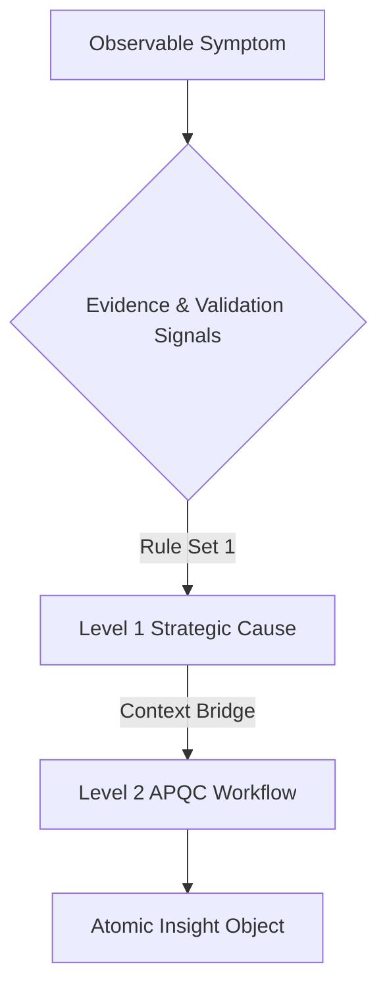

# TarkaX Architecture: Root Cause Engine v1

**CONFIDENTIAL INTERNAL RESEARCH ARTIFACT**
**Domain**: Operational Intelligence & Diagnostics
**Author**: Principal Enterprise Architect & Operations Consultant
**Target Phase**: Phase 4 Intelligence Layer

## Executive Summary
TarkaX is transitioning from a descriptive diagnostic platform ("What is the score?") to an active operational intelligence platform ("Why is the organization failing?"). The Root Cause Engine v1 serves as the foundational intelligence layer. It sits structurally between Evidence Validation and Benchmark/Recommendation layers.

Its primary function is to process validated assessment evidence deterministically, map symptoms to systemic operational failures, and produce high-confidence organizational intelligence. By establishing a bridge between Strategic Failure Categories and the APQC Workflow Taxonomy, it isolates exact functional breakdowns. Furthermore, it inherently supports cross-audit analysis to measure the "Organizational Reality Gap"—the dissonance between leadership perception and execution reality.

**Design Constraint**: This engine is 100% deterministic. It utilizes rule-driven matrices (Symptom + Evidence + Validation Signals -> Root Cause) to ensure absolute auditability, explainability, and trust for enterprise and government clientele. Probabilistic LLM inferences are explicitly excluded from cause generation in V1.

---

## 1. Root Cause Framework

The Root Cause Framework represents the analytical progression from a surface-level finding to a systemic operational cause. This progression generates the **Atomic Insight Object**, which acts as the standardized payload consumed by downstream reporting, forecasting, and consultant interfaces.

### 1.1 The Deterministic Processing Pipeline
1. **Symptom Ingestion**: Pull derived findings from Assessment Responses, Workflow Diagnostics, and AI Audits.
2. **Evidence Association**: Attach validated L2-L5 evidence to the symptom.
3. **Rule Engine Evaluation**: Apply threshold-based logic to categorize the root cause.
4. **Insight Generation**: Produce the final structured insight object.

*Note: The Root Cause Engine does NOT calculate business risk. It exposes capability gaps and impacts to the Benchmark/Risk layer for final risk profiling.*

### 1.2 The Atomic Insight Object Structure
Every root cause generated must adhere to this standardized output structure:

- **Finding**: The observable symptom or operational pain point.
- **Evidence**: The quantitative or qualitative data proving the symptom.
- **Root Cause**: The underlying systemic breakdown (categorized via Taxonomy).
- **Confidence**: Deterministic certainty score of the diagnosis.
- **Impact**: The operational cost or functional friction caused.
- **Recommended Action**: High-level structural intervention.
- **Expected Outcome**: The forecasted operational capability gain.

---

## 2. Root Cause Taxonomy

To ensure scalability and APQC alignment, root causes are modeled across two tiers. A root cause is never just a "Governance Failure"; it is a "Governance Failure within a specific APQC workflow context."

### 2.1 Level 1: Strategic Failure Categories
The master classifications for systemic breakdown:
- **Governance**: Lack of policies, controls, or ownership definition.
- **Leadership**: Sponsorship, alignment, or strategic communication failures.
- **Process Design**: Inefficient routing, lack of standardization, or poor architecture.
- **Change Management**: Resistance, adoption failure, or poor rollout execution.
- **Knowledge Management**: Siloed data, tribal knowledge, lack of documentation.
- **Technology & Tooling**: Tool proliferation, integration gaps, complex UX.
- **Resource Allocation**: Budget constraints, understaffing, capability shortages.
- **Compliance & Risk**: Control bypassing, regulatory exposure.
- **Communication**: Information silos, broken feedback loops.
- **Training & Enablement**: Skill gaps, onboarding failures.

### 2.2 Level 2: APQC Workflow Mapping
The bridging mechanism assigns Level 1 failures to exact APQC-defined operational nodes.

**Bridge Example:**
* **Strategic Failure**: Knowledge Management
* **Bridge**: Missing documentation creating a Single Point of Failure (SPOF)
* **APQC Workflow**: 3.2.1.1 Process Payroll (Finance)
* **Generated Context**: "Knowledge Management Failure occurring within the Payroll Processing Workflow."

---

## 3. Failure Tree Design

Failure trees represent the deterministic logic paths. They map an observable symptom to a root cause by requesting specific evidence.

### 3.1 Master Taxonomy Architecture

### 3.2 Detailed Failure Tree Examples

#### Example 1: Low AI Adoption
- **Symptom**: AI tool usage < 15% across target user base.
- **Potential Causes & Evidence Required**:
  - *No Training*: Evidence of 0 enablement hours logged -> **Root Cause**: Training & Enablement Failure.
  - *No Leadership Sponsorship*: Absence of executive communication on AI strategy -> **Root Cause**: Leadership Failure.
  - *Tool Complexity*: High drop-off rate after initial login -> **Root Cause**: Technology & Tooling Failure.
  - *Poor Governance*: Unclear policies causing risk aversion -> **Root Cause**: Governance Failure.

#### Example 2: Approval Bottlenecks
- **Symptom**: Approval cycle time > established SLA.
- **Potential Causes & Evidence Required**:
  - *No Delegated Structure*: 100% of approvals route to single executive -> **Root Cause**: Process Design Failure.
  - *Tool Friction*: Approvers lack mobile access / complex UI -> **Root Cause**: Technology & Tooling Failure.
  - *Ambiguous Authority*: Approvals sent back for clarification > 30% of time -> **Root Cause**: Governance Failure.

#### Example 3: Workflow Visibility Failure
- **Symptom**: Management cannot report on real-time process status.
- **Potential Causes & Evidence Required**:
  - *Ad-Hoc Execution*: Processes managed in local spreadsheets / email -> **Root Cause**: Process Design Failure.
  - *Integration Gaps*: Systems of record do not talk to systems of engagement -> **Root Cause**: Technology & Tooling Failure.
  - *Unclear Ownership*: No defined process owner responsible for reporting -> **Root Cause**: Governance Failure.

#### Example 4: Governance Failure
- **Symptom**: High rate of unauthorized policy deviations or compliance violations.
- **Potential Causes & Evidence Required**:
  - *Outdated Policies*: Standard Operating Procedures (SOPs) unreviewed for > 12 months -> **Root Cause**: Knowledge Management Failure.
  - *Lack of Controls*: System allows bypass of required approvals -> **Root Cause**: Process Design Failure.
  - *Misaligned Incentives*: Staff rewarded for speed over compliance -> **Root Cause**: Leadership Failure.

#### Example 5: Knowledge Dependency Risk
- **Symptom**: Process stalls entirely when specific individual is absent (SPOF).
- **Potential Causes & Evidence Required**:
  - *Tribal Knowledge*: Process steps undocumented -> **Root Cause**: Knowledge Management Failure.
  - *Access Constraints*: Only one user possesses system credentials -> **Root Cause**: Governance Failure.
  - *Skill Concentration*: Niche technical skill not cross-trained -> **Root Cause**: Training & Enablement Failure.

---

## 4. Confidence Methodology

The Confidence Index is inherited from the Validation Layer and modulated by the Root Cause Engine based on signal strength. It relies purely on deterministic indicators.

**Root Cause Confidence = (Evidence Quality Weight) + (Consistency Weight) - (Contradiction Penalty) + (Completeness Weight)**

### 4.1 Scoring Factors
1. **Evidence Quality**: Evaluated on the 5-level maturity model (L1 Assertion -> L5 Supporting Artifact). Higher quality evidence exponentially increases diagnostic confidence.
2. **Response Consistency**: Variance across multiple respondents answering identical or correlated questions.
3. **Contradiction Count**: Number of direct logical contradictions identified within the dataset.
4. **Assessment Completeness**: Percentage of related APQC nodes effectively mapped and validated.

**Example**: A high Contradiction Count (e.g., Leadership says process is automated, Audit logs show manual data entry) explicitly penalizes single-source confidence, triggering a Cross-Audit Root Cause.

---

## 5. Multi-Audit Support & The "Organizational Reality Gap"

TarkaX uniquely identifies systemic failures by analyzing the dissonance between different strata of the organization.

### 5.1 The Organizational Reality Gap
When multiple audits are run in tandem (e.g., Leadership vs. Employee), the engine does not treat them in isolation. A contradiction *is* the evidence.

- **Leadership Audit Input**: "Process is highly standardized."
- **Employee Audit Input**: "Process is managed via ad-hoc spreadsheets."
- **Contradiction Detected**: Triggers specific Cross-Audit Root Cause logic.

### 5.2 Multi-Audit Breakdown
1. **Leadership Audit**
   - **Inputs**: Strategic goals, perceived capabilities, budget allocation.
   - **Typical Root Causes**: Resource Allocation, Strategic Communication, Leadership Sponsorship.
2. **Manager Audit**
   - **Inputs**: Team performance, operational friction, policy enforcement.
   - **Typical Root Causes**: Middle-management bottlenecks, Change Management failures.
3. **Employee Audit**
   - **Inputs**: Daily execution pain points, tool satisfaction, time-wasted metrics.
   - **Typical Root Causes**: Tooling friction, Knowledge silos, Ad-hoc process design.
4. **AI Audit**
   - **Inputs**: AI tool inventory, usage metrics, perceived value.
   - **Typical Root Causes**: Governance (Shadow IT), Training gaps, Misalignment on value.
5. **Workflow Diagnostic**
   - **Inputs**: APQC process steps, cycle times, mapped owners.
   - **Typical Root Causes**: Process Design (loops/rework), Approval bottlenecks.
6. **Alignment Audit (Cross-Audit)**
   - **Inputs**: Dissonance metrics between Tiers (Leadership vs Employee).
   - **Typical Root Causes**: Execution Gap, Delusional Leadership Perception, Communication Breakdown.

---

## 6. Consultant Output Design

The Root Cause Engine powers the Consultant Dashboard, transforming raw diagnostic data into a Board-ready structured insight.

### 6.1 Sample Consultant View
> **FINDING #1: Critical Approval Bottleneck in APQC 3.2.1 (Procure-to-Pay)**
>
> **Root Cause**:
> Workflow Ownership Ambiguity / Process Design Failure
>
> **Evidence**:
> - No named owner in 63% of responses.
> - Employee Audit contradiction: 40% of staff route to Department Head, 60% route to Finance Director.
>
> **Impact**:
> End-to-end cycle time increases by an average of 4.2 days per transaction.
>
> **Risk Level**:
> *High* (Inherited from Benchmark Layer: Critical Business Workflow + High Exposure)
>
> **Confidence**:
> 87% (High Evidence Quality, High Completeness, Validated Contradiction)
>
> **Recommended Action**:
> Implement a delegated approval matrix and formally assign workflow ownership.
>
> **Expected Outcome**:
> Reduce cycle time by 18%; eliminate leadership dependency for sub-$10k approvals.

---

## 7. Future Integration Plan

To fully operationalize this architecture in Phase 4 and Phase 5, the following technical domains will eventually consume the Root Cause Engine's outputs:

### 7.1 Backend Services
- `RootCauseEngineService` (Python/FastAPI): Executes the deterministic rule sets against the validated evidence payload.
- `CrossAuditAnalyzerService`: Specifically evaluates the "Organizational Reality Gap" contradictions.
- `TaxonomyMapperService`: Maps Level 1 Strategic Failures to Level 2 APQC nodes.

### 7.2 Database Tables (PostgreSQL)
- `diagnostic_findings`: Stores the observed symptoms.
- `root_cause_rules`: Configurable rules engine parameters (Symptom + Evidence -> Cause).
- `insight_objects`: The finalized Atomic Insight Object mapped to an assessment context.
- `organizational_gaps`: Specifically tracks the contradictions across multiple audits.

### 7.3 Frontend Screens
- **Consultant Mode Dashboard**: Displays high-level findings, root causes, and expected outcomes.
- **Evidence Traceability Viewer**: Allows a user to click a Root Cause and traverse down the tree to the exact audit response/contradiction that proved it.
- **Reality Gap Matrix**: Visualizes the dissonance between Leadership perception and Employee reality.

### 7.4 Report Sections
- **Executive Summary**: Aggregates Level 1 Strategic Failure Categories across the enterprise.
- **Operational Risk Profile**: Merges Root Causes with capability gaps to highlight critical failure points.
- **The TarkaX Action Plan**: Transitions Recommended Actions into forecasted capability roadmaps.
